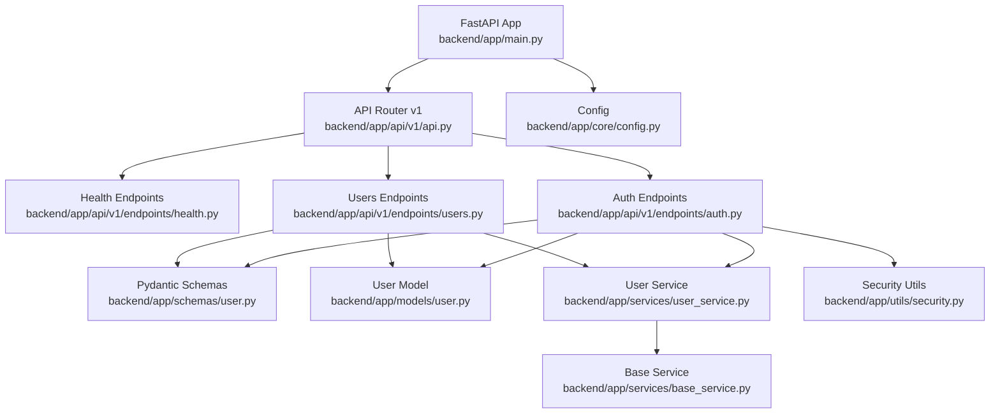
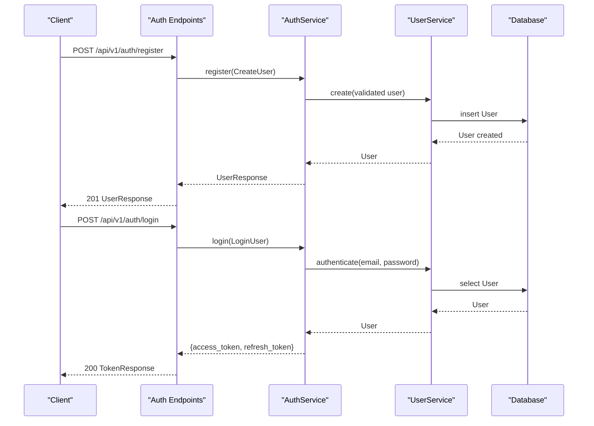
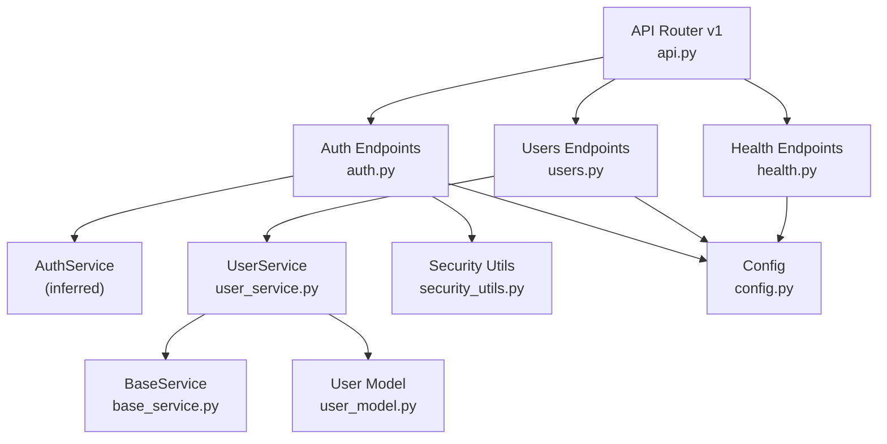
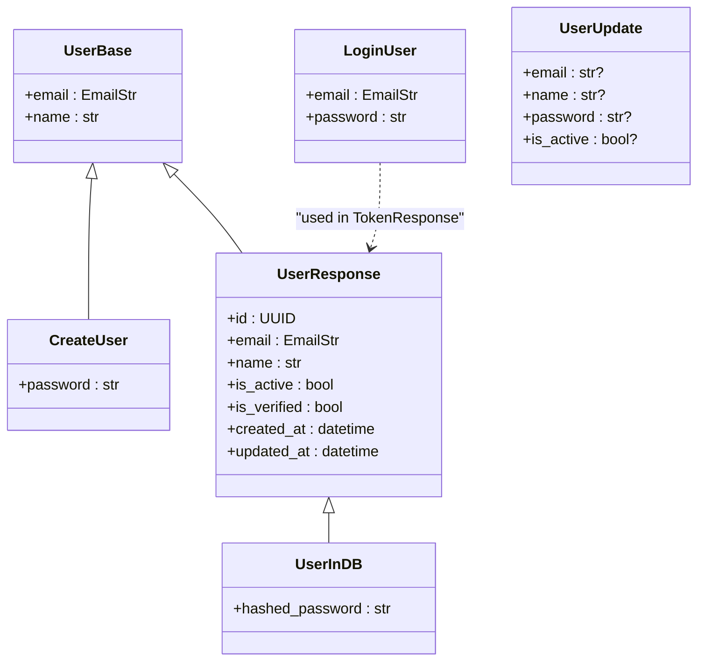

# API Reference

<cite>
**Referenced Files in This Document**
- [main.py](file://backend/app/main.py)
- [api.py](file://backend/app/api/v1/api.py)
- [health.py](file://backend/app/api/v1/endpoints/health.py)
- [auth.py](file://backend/app/api/v1/endpoints/auth.py)
- [users.py](file://backend/app/api/v1/endpoints/users.py)
- [user_schemas.py](file://backend/app/schemas/user.py)
- [user_model.py](file://backend/app/models/user.py)
- [user_service.py](file://backend/app/services/user_service.py)
- [base_service.py](file://backend/app/services/base_service.py)
- [security_utils.py](file://backend/app/utils/security.py)
- [config.py](file://backend/app/core/config.py)
- [test_health.py](file://backend/tests/test_health.py)
</cite>

## Table of Contents
1. [Introduction](#introduction)
2. [Project Structure](#project-structure)
3. [Core Components](#core-components)
4. [Architecture Overview](#architecture-overview)
5. [Detailed Component Analysis](#detailed-component-analysis)
6. [Dependency Analysis](#dependency-analysis)
7. [Performance Considerations](#performance-considerations)
8. [Troubleshooting Guide](#troubleshooting-guide)
9. [Conclusion](#conclusion)
10. [Appendices](#appendices)

## Introduction
This document provides a comprehensive API reference for Hyrex AI’s backend. It covers:
- Health check endpoints and system status verification
- Authentication endpoints for registration, login, and current user retrieval
- User management endpoints for listing, creating, retrieving, updating, and deleting users
- Request/response schemas using Pydantic models
- Authentication and authorization requirements
- Error responses and validation rules
- API versioning strategy, rate limiting, and security considerations
- Client implementation examples and common usage patterns

## Project Structure
The backend is built with FastAPI and organized by versioned API groups. The v1 API aggregates health, authentication, and user endpoints under a shared prefix.

**Diagram sources**
- [main.py:1-116](file://backend/app/main.py#L1-L116)
- [api.py:1-14](file://backend/app/api/v1/api.py#L1-L14)
- [health.py:1-56](file://backend/app/api/v1/endpoints/health.py#L1-L56)
- [auth.py:1-183](file://backend/app/api/v1/endpoints/auth.py#L1-L183)
- [users.py:1-119](file://backend/app/api/v1/endpoints/users.py#L1-L119)
- [user_schemas.py:1-49](file://backend/app/schemas/user.py#L1-L49)
- [user_model.py:1-50](file://backend/app/models/user.py#L1-L50)
- [user_service.py:1-127](file://backend/app/services/user_service.py#L1-L127)
- [base_service.py:1-152](file://backend/app/services/base_service.py#L1-L152)
- [security_utils.py:1-98](file://backend/app/utils/security.py#L1-L98)
- [config.py:1-131](file://backend/app/core/config.py#L1-L131)

**Section sources**
- [main.py:1-116](file://backend/app/main.py#L1-L116)
- [api.py:1-14](file://backend/app/api/v1/api.py#L1-L14)

## Core Components
- API Versioning: All endpoints are prefixed with /api/v1.
- Health Checks: Basic, readiness (DB), and liveness checks.
- Authentication: JWT-based access/refresh tokens with OAuth2-compatible login endpoints.
- User Management: Full CRUD with pagination and validation via Pydantic models.
- Configuration: Centralized settings for CORS, security, rate limits, and pagination defaults.

**Section sources**
- [main.py:76-77](file://backend/app/main.py#L76-L77)
- [config.py:66-71](file://backend/app/core/config.py#L66-L71)

## Architecture Overview
The API follows a layered architecture:
- Controllers (endpoints) handle HTTP requests and responses
- Services encapsulate business logic and interact with the database
- Pydantic schemas define request/response contracts
- SQLAlchemy models represent persistence
- Security utilities manage token encoding/decoding and password hashing

**Diagram sources**
- [auth.py:21-53](file://backend/app/api/v1/endpoints/auth.py#L21-L53)
- [auth.py:55-91](file://backend/app/api/v1/endpoints/auth.py#L55-L91)
- [user_service.py:51-74](file://backend/app/services/user_service.py#L51-L74)
- [user_service.py:102-118](file://backend/app/services/user_service.py#L102-L118)

## Detailed Component Analysis

### Health Endpoints
- Purpose: Verify service status and database connectivity.
- Base URL: /api/v1/health

Endpoints:
- GET /api/v1/health/
  - Description: Basic health check returning service status.
  - Authentication: Not required.
  - Response: JSON with status and service identifier.
  - Example response:
    - {"status":"healthy","service":"api"}

- GET /api/v1/health/ready
  - Description: Readiness check verifying database connectivity.
  - Authentication: Not required.
  - Response: JSON indicating status and database connection state.
  - Example response:
    - {"status":"ready","database":"connected"}
  - Error responses:
    - 500 Internal Server Error if DB check fails.

- GET /api/v1/health/live
  - Description: Liveness check confirming the service is running.
  - Authentication: Not required.
  - Response: JSON with status.
  - Example response:
    - {"status":"alive"}

Validation rules:
- No request body required.

Common usage patterns:
- Kubernetes readiness probe: GET /api/v1/health/ready
- Load balancer health checks: GET /api/v1/health/live

**Section sources**
- [health.py:15-21](file://backend/app/api/v1/endpoints/health.py#L15-L21)
- [health.py:24-44](file://backend/app/api/v1/endpoints/health.py#L24-L44)
- [health.py:47-55](file://backend/app/api/v1/endpoints/health.py#L47-L55)

### Authentication Endpoints
- Purpose: Registration, login, and current user retrieval.
- Base URL: /api/v1/auth

Endpoints:
- POST /api/v1/auth/register
  - Description: Register a new user.
  - Authentication: Not required.
  - Request body: CreateUser (name, email, password)
  - Response: UserResponse (id, email, name, is_active, is_verified, created_at, updated_at)
  - Success: 201 Created
  - Error responses:
    - 400 Bad Request if email already exists or validation fails
  - Validation rules:
    - password length >= 8
    - email must be valid
  - Example request:
    - {"name":"John Doe","email":"john@example.com","password":"SecurePass123"}
  - Example response:
    - {"id":"<UUID>","email":"john@example.com","name":"John Doe","is_active":true,"is_verified":false,"created_at":"2025-01-01T00:00:00Z","updated_at":"2025-01-01T00:00:00Z"}

- POST /api/v1/auth/login
  - Description: Login with email/password and receive tokens.
  - Authentication: Not required.
  - Request body: LoginUser (email, password)
  - Response: TokenResponse (access_token, refresh_token, token_type, user)
  - Success: 200 OK
  - Error responses:
    - 401 Unauthorized if credentials are invalid
  - Validation rules:
    - email must be valid
    - password length >= 1
  - Example request:
    - {"email":"john@example.com","password":"SecurePass123"}
  - Example response:
    - {"access_token":"<JWT>","refresh_token":"<JWT>","token_type":"bearer","user":{"id":"<UUID>","email":"john@example.com","name":"John Doe","is_active":true,"is_verified":false,"created_at":"2025-01-01T00:00:00Z","updated_at":"2025-01-01T00:00:00Z"}}

- POST /api/v1/auth/login/form
  - Description: OAuth2 password flow compatible with Swagger UI.
  - Authentication: Not required.
  - Request: Form-encoded (username=email, password)
  - Response: TokenResponse
  - Success: 200 OK
  - Error responses:
    - 401 Unauthorized if credentials are invalid

- GET /api/v1/auth/me
  - Description: Retrieve current authenticated user.
  - Authentication: Bearer JWT required.
  - Response: UserResponse
  - Success: 200 OK
  - Error responses:
    - 401 Unauthorized if token is invalid/expired
    - 403 Forbidden if user is inactive
    - 404 Not Found if user does not exist
  - Example response:
    - {"id":"<UUID>","email":"john@example.com","name":"John Doe","is_active":true,"is_verified":false,"created_at":"2025-01-01T00:00:00Z","updated_at":"2025-01-01T00:00:00Z"}

Security considerations:
- Access tokens are signed with HS256 and configured expiration.
- Refresh tokens are supported via utilities.
- Passwords are hashed using bcrypt before storage.

**Section sources**
- [auth.py:21-53](file://backend/app/api/v1/endpoints/auth.py#L21-L53)
- [auth.py:55-91](file://backend/app/api/v1/endpoints/auth.py#L55-L91)
- [auth.py:94-128](file://backend/app/api/v1/endpoints/auth.py#L94-L128)
- [auth.py:131-182](file://backend/app/api/v1/endpoints/auth.py#L131-L182)
- [security_utils.py:27-78](file://backend/app/utils/security.py#L27-L78)
- [config.py:55-59](file://backend/app/core/config.py#L55-L59)

### User Management Endpoints
- Purpose: List, create, retrieve, update, and delete users with pagination.
- Base URL: /api/v1/users

Endpoints:
- GET /api/v1/users
  - Description: List users with pagination.
  - Authentication: Bearer JWT required.
  - Query parameters:
    - skip: integer >= 0 (default: 0)
    - limit: integer between 1 and 100 (default: 20)
  - Response: Array of UserResponse
  - Success: 200 OK
  - Example response:
    - [{"id":"<UUID>","email":"john@example.com","name":"John Doe","is_active":true,"is_verified":false,"created_at":"2025-01-01T00:00:00Z","updated_at":"2025-01-01T00:00:00Z"}]

- POST /api/v1/users
  - Description: Create a new user.
  - Authentication: Bearer JWT required.
  - Request body: CreateUser (name, email, password)
  - Response: UserResponse
  - Success: 201 Created
  - Error responses:
    - 400 Bad Request if email already exists
  - Validation rules:
    - password length >= 8
    - email must be valid
  - Example request:
    - {"name":"Jane Doe","email":"jane@example.com","password":"AnotherPass456"}
  - Example response:
    - {"id":"<UUID>","email":"jane@example.com","name":"Jane Doe","is_active":true,"is_verified":false,"created_at":"2025-01-01T00:00:00Z","updated_at":"2025-01-01T00:00:00Z"}

- GET /api/v1/users/{user_id}
  - Description: Get a specific user by UUID.
  - Authentication: Bearer JWT required.
  - Path parameters:
    - user_id: UUID
  - Response: UserResponse
  - Success: 200 OK
  - Error responses:
    - 404 Not Found if user does not exist
  - Example response:
    - {"id":"<UUID>","email":"jane@example.com","name":"Jane Doe","is_active":true,"is_verified":false,"created_at":"2025-01-01T00:00:00Z","updated_at":"2025-01-01T00:00:00Z"}

- PUT /api/v1/users/{user_id}
  - Description: Update a user.
  - Authentication: Bearer JWT required.
  - Path parameters:
    - user_id: UUID
  - Request body: UserUpdate (optional fields: email, name, password, is_active)
  - Response: UserResponse
  - Success: 200 OK
  - Error responses:
    - 404 Not Found if user does not exist
  - Validation rules:
    - password length >= 8 if provided
    - email must be valid if provided
    - name length between 1 and 255 if provided
  - Example request:
    - {"email":"newemail@example.com","name":"Jane Smith","password":"UpdatedPass789","is_active":true}

- DELETE /api/v1/users/{user_id}
  - Description: Delete a user.
  - Authentication: Bearer JWT required.
  - Path parameters:
    - user_id: UUID
  - Response: No content (204 No Content)
  - Error responses:
    - 404 Not Found if user does not exist

Request/response schemas:
- CreateUser: name, email, password
- UserUpdate: email, name, password, is_active (all optional)
- UserResponse: id, email, name, is_active, is_verified, created_at, updated_at
- TokenResponse: access_token, refresh_token, token_type, user (UserResponse)

Validation rules summary:
- name: min_length 1, max_length 255
- password: min_length 8 (when creating/updating)
- email: valid email format
- skip: >= 0
- limit: between 1 and 100

Common usage patterns:
- Paginated listing: GET /api/v1/users?skip=0&limit=20
- Create user: POST /api/v1/users with CreateUser payload
- Update user: PUT /api/v1/users/{user_id} with UserUpdate payload
- Delete user: DELETE /api/v1/users/{user_id}

**Section sources**
- [users.py:19-30](file://backend/app/api/v1/endpoints/users.py#L19-L30)
- [users.py:33-53](file://backend/app/api/v1/endpoints/users.py#L33-L53)
- [users.py:56-73](file://backend/app/api/v1/endpoints/users.py#L56-L73)
- [users.py:76-96](file://backend/app/api/v1/endpoints/users.py#L76-L96)
- [users.py:99-118](file://backend/app/api/v1/endpoints/users.py#L99-L118)
- [user_schemas.py:16-49](file://backend/app/schemas/user.py#L16-L49)

### Root and Global Health
- GET /
  - Description: Application metadata and links to docs (only in non-production).
  - Response: JSON with name, version, environment, and docs link if applicable.
  - Example response:
    - {"name":"Hyrex AI","version":"1.0.0","environment":"development","docs":"/docs"}

- GET /health
  - Description: Simple health status.
  - Response: JSON with status and version.
  - Example response:
    - {"status":"healthy","version":"1.0.0"}

**Section sources**
- [main.py:98-106](file://backend/app/main.py#L98-L106)
- [main.py:109-115](file://backend/app/main.py#L109-L115)

## Dependency Analysis

**Diagram sources**
- [api.py:7-13](file://backend/app/api/v1/api.py#L7-L13)
- [health.py:1-12](file://backend/app/api/v1/endpoints/health.py#L1-L12)
- [auth.py:1-16](file://backend/app/api/v1/endpoints/auth.py#L1-L16)
- [users.py:1-16](file://backend/app/api/v1/endpoints/users.py#L1-L16)
- [user_service.py:18-25](file://backend/app/services/user_service.py#L18-L25)
- [base_service.py:19-31](file://backend/app/services/base_service.py#L19-L31)
- [user_model.py:13-49](file://backend/app/models/user.py#L13-L49)
- [security_utils.py:1-14](file://backend/app/utils/security.py#L1-L14)
- [config.py:1-131](file://backend/app/core/config.py#L1-L131)

**Section sources**
- [api.py:7-13](file://backend/app/api/v1/api.py#L7-L13)
- [user_service.py:18-25](file://backend/app/services/user_service.py#L18-L25)
- [base_service.py:19-31](file://backend/app/services/base_service.py#L19-L31)

## Performance Considerations
- Compression: GZip middleware enabled for responses larger than 1000 bytes.
- Pagination: Default page size and maximum page size are configurable.
- Database: Async SQLAlchemy session used; readiness check validates DB connectivity.
- Recommendations:
  - Use pagination parameters (skip, limit) for listing endpoints.
  - Enable client-side caching for read-heavy endpoints where appropriate.
  - Monitor DB connection pool sizing and timeouts in production.

**Section sources**
- [main.py:73-74](file://backend/app/main.py#L73-L74)
- [config.py:69-71](file://backend/app/core/config.py#L69-L71)
- [health.py:24-44](file://backend/app/api/v1/endpoints/health.py#L24-L44)

## Troubleshooting Guide
Common errors and resolutions:
- 400 Bad Request during registration:
  - Cause: Email already exists or validation failure.
  - Resolution: Ensure unique email and meet password/name constraints.

- 400 Bad Request during user creation/update:
  - Cause: Validation failure (password/email/name constraints).
  - Resolution: Adjust payload to satisfy schema requirements.

- 401 Unauthorized:
  - Login failures: Invalid credentials.
  - Protected endpoints: Missing or invalid Bearer token.
  - Resolution: Re-authenticate or renew token.

- 403 Forbidden:
  - Cause: User account is inactive.
  - Resolution: Contact administrator to activate the account.

- 404 Not Found:
  - Cause: User not found by ID.
  - Resolution: Verify the UUID and that the user exists.

- 500 Internal Server Error:
  - Cause: Unhandled exceptions or DB readiness failure.
  - Resolution: Check logs and ensure DB connectivity.

Testing readiness:
- Use GET /api/v1/health/ready to confirm database connectivity before scaling traffic.

**Section sources**
- [users.py:44-49](file://backend/app/api/v1/endpoints/users.py#L44-L49)
- [users.py:67-71](file://backend/app/api/v1/endpoints/users.py#L67-L71)
- [users.py:88-92](file://backend/app/api/v1/endpoints/users.py#L88-L92)
- [users.py:110-114](file://backend/app/api/v1/endpoints/users.py#L110-L114)
- [auth.py:85-91](file://backend/app/api/v1/endpoints/auth.py#L85-L91)
- [auth.py:151-157](file://backend/app/api/v1/endpoints/auth.py#L151-L157)
- [auth.py:170-174](file://backend/app/api/v1/endpoints/auth.py#L170-L174)
- [health.py:39-44](file://backend/app/api/v1/endpoints/health.py#L39-L44)
- [main.py:85-95](file://backend/app/main.py#L85-L95)

## Conclusion
Hyrex AI’s API provides a robust, versioned set of endpoints for health monitoring, authentication, and user management. It leverages Pydantic for strict request/response validation, JWT for secure authentication, and a layered service architecture for maintainability. By following the documented schemas, authentication requirements, and validation rules, clients can integrate seamlessly with the backend.

## Appendices

### API Versioning Strategy
- All endpoints are prefixed with /api/v1.
- Versioning is explicit and allows future breaking changes under new versions.

**Section sources**
- [main.py:77](file://backend/app/main.py#L77)
- [api.py:11-13](file://backend/app/api/v1/api.py#L11-L13)

### Rate Limiting Policies
- Rate limit per minute is configurable via environment variable.
- Apply at the gateway or middleware level as needed.

**Section sources**
- [config.py:66-67](file://backend/app/core/config.py#L66-L67)

### Security Considerations
- Secret key, algorithm, and token expirations are configurable.
- Passwords are hashed with bcrypt.
- Tokens use HS256 signing.

**Section sources**
- [config.py:55-59](file://backend/app/core/config.py#L55-L59)
- [user_service.py:14-15](file://backend/app/services/user_service.py#L14-L15)
- [security_utils.py:27-78](file://backend/app/utils/security.py#L27-L78)

### Client Implementation Examples

- Register a user:
  - Method: POST
  - URL: /api/v1/auth/register
  - Headers: Content-Type: application/json
  - Body: CreateUser
  - Expected success: 201 with UserResponse

- Login and retrieve tokens:
  - Method: POST
  - URL: /api/v1/auth/login
  - Headers: Content-Type: application/json
  - Body: LoginUser
  - Expected success: 200 with TokenResponse

- Fetch current user:
  - Method: GET
  - URL: /api/v1/auth/me
  - Headers: Authorization: Bearer <access_token>
  - Expected success: 200 with UserResponse

- List users with pagination:
  - Method: GET
  - URL: /api/v1/users?skip=0&limit=20
  - Headers: Authorization: Bearer <access_token>
  - Expected success: 200 with array of UserResponse

- Create a user:
  - Method: POST
  - URL: /api/v1/users
  - Headers: Authorization: Bearer <access_token>, Content-Type: application/json
  - Body: CreateUser
  - Expected success: 201 with UserResponse

- Update a user:
  - Method: PUT
  - URL: /api/v1/users/{user_id}
  - Headers: Authorization: Bearer <access_token>, Content-Type: application/json
  - Body: UserUpdate
  - Expected success: 200 with UserResponse

- Delete a user:
  - Method: DELETE
  - URL: /api/v1/users/{user_id}
  - Headers: Authorization: Bearer <access_token>
  - Expected success: 204 No Content

### Data Models Reference

**Diagram sources**
- [user_schemas.py:10-49](file://backend/app/schemas/user.py#L10-L49)