# Authentication System

<cite>
**Referenced Files in This Document**
- [AuthContext.tsx](file://src/contexts/AuthContext.tsx)
- [App.tsx](file://src/App.tsx)
- [SignIn.tsx](file://src/pages/SignIn.tsx)
- [Profile.tsx](file://src/pages/Profile.tsx)
- [main.py](file://backend/app/main.py)
- [api.py](file://backend/app/api/v1/api.py)
- [users.py](file://backend/app/api/v1/endpoints/users.py)
- [user.py](file://backend/app/models/user.py)
- [user_service.py](file://backend/app/services/user_service.py)
- [security.py](file://backend/app/utils/security.py)
- [config.py](file://backend/app/core/config.py)
- [session.py](file://backend/app/db/session.py)
- [base_service.py](file://backend/app/services/base_service.py)
- [health.py](file://backend/app/api/v1/endpoints/health.py)
</cite>

## Table of Contents
1. [Introduction](#introduction)
2. [Project Structure](#project-structure)
3. [Core Components](#core-components)
4. [Architecture Overview](#architecture-overview)
5. [Detailed Component Analysis](#detailed-component-analysis)
6. [Dependency Analysis](#dependency-analysis)
7. [Performance Considerations](#performance-considerations)
8. [Troubleshooting Guide](#troubleshooting-guide)
9. [Conclusion](#conclusion)

## Introduction
This document explains the authentication and authorization system implemented in the project. It covers the React-based authentication context, user registration and login flows, session management, backend authentication services, password hashing, token-based authentication utilities, and the user service layer. It also outlines security best practices, session timeout handling, logout procedures, and troubleshooting guidance for common authentication issues.

## Project Structure
The authentication system spans two applications:
- Frontend (React): Provides user-facing authentication UI and local session persistence.
- Backend (FastAPI): Implements user management, password hashing, token generation, and database integration.

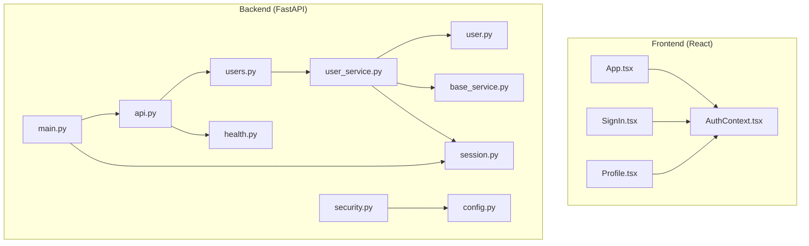

**Diagram sources**
- [App.tsx:14-31](file://src/App.tsx#L14-L31)
- [AuthContext.tsx:20-41](file://src/contexts/AuthContext.tsx#L20-L41)
- [SignIn.tsx:8-24](file://src/pages/SignIn.tsx#L8-L24)
- [main.py:49-82](file://backend/app/main.py#L49-L82)
- [api.py:7-13](file://backend/app/api/v1/api.py#L7-L13)
- [users.py:19-53](file://backend/app/api/v1/endpoints/users.py#L19-L53)
- [user_service.py:18-35](file://backend/app/services/user_service.py#L18-L35)
- [user.py:13-47](file://backend/app/models/user.py#L13-L47)
- [base_service.py:19-31](file://backend/app/services/base_service.py#L19-L31)
- [session.py:32-53](file://backend/app/db/session.py#L32-L53)
- [config.py:55-59](file://backend/app/core/config.py#L55-L59)
- [security.py:27-90](file://backend/app/utils/security.py#L27-L90)
- [health.py:15-21](file://backend/app/api/v1/endpoints/health.py#L15-L21)

**Section sources**
- [App.tsx:14-31](file://src/App.tsx#L14-L31)
- [AuthContext.tsx:20-41](file://src/contexts/AuthContext.tsx#L20-L41)
- [SignIn.tsx:8-24](file://src/pages/SignIn.tsx#L8-L24)
- [main.py:49-82](file://backend/app/main.py#L49-L82)
- [api.py:7-13](file://backend/app/api/v1/api.py#L7-L13)
- [users.py:19-53](file://backend/app/api/v1/endpoints/users.py#L19-L53)
- [user_service.py:18-35](file://backend/app/services/user_service.py#L18-L35)
- [user.py:13-47](file://backend/app/models/user.py#L13-L47)
- [base_service.py:19-31](file://backend/app/services/base_service.py#L19-L31)
- [session.py:32-53](file://backend/app/db/session.py#L32-L53)
- [config.py:55-59](file://backend/app/core/config.py#L55-L59)
- [security.py:27-90](file://backend/app/utils/security.py#L27-L90)
- [health.py:15-21](file://backend/app/api/v1/endpoints/health.py#L15-L21)

## Core Components
- Frontend Authentication Context
  - Provides user state, authentication status, sign-in, and sign-out actions.
  - Persists user data to local storage for session continuity across browser sessions.
  - Exposes a hook to consume authentication state in components.

- Backend User Management
  - Endpoints for listing, creating, retrieving, updating, and deleting users.
  - Validation via Pydantic schemas and uniqueness checks on email.
  - Business logic encapsulated in a service layer with password hashing and verification.

- Security Utilities
  - Password hashing and verification using bcrypt.
  - JWT access and refresh token creation, decoding, and type verification.
  - Centralized configuration for secrets, algorithms, and token expiration.

- Database Session Management
  - Async SQLAlchemy session factory with dependency injection for FastAPI.
  - Automatic commit/rollback and session lifecycle management.

**Section sources**
- [AuthContext.tsx:3-16](file://src/contexts/AuthContext.tsx#L3-L16)
- [AuthContext.tsx:20-41](file://src/contexts/AuthContext.tsx#L20-L41)
- [users.py:19-53](file://backend/app/api/v1/endpoints/users.py#L19-L53)
- [user_service.py:18-35](file://backend/app/services/user_service.py#L18-L35)
- [security.py:17-24](file://backend/app/utils/security.py#L17-L24)
- [security.py:27-90](file://backend/app/utils/security.py#L27-L90)
- [session.py:32-53](file://backend/app/db/session.py#L32-L53)

## Architecture Overview
The system follows a layered architecture:
- Presentation Layer (React): Renders authentication UI and manages local session state.
- API Layer (FastAPI): Exposes REST endpoints for user management.
- Service Layer: Implements business logic, including password hashing and user operations.
- Persistence Layer: Uses asynchronous SQLAlchemy with PostgreSQL.
- Security Layer: Provides hashing and JWT utilities configured via environment settings.

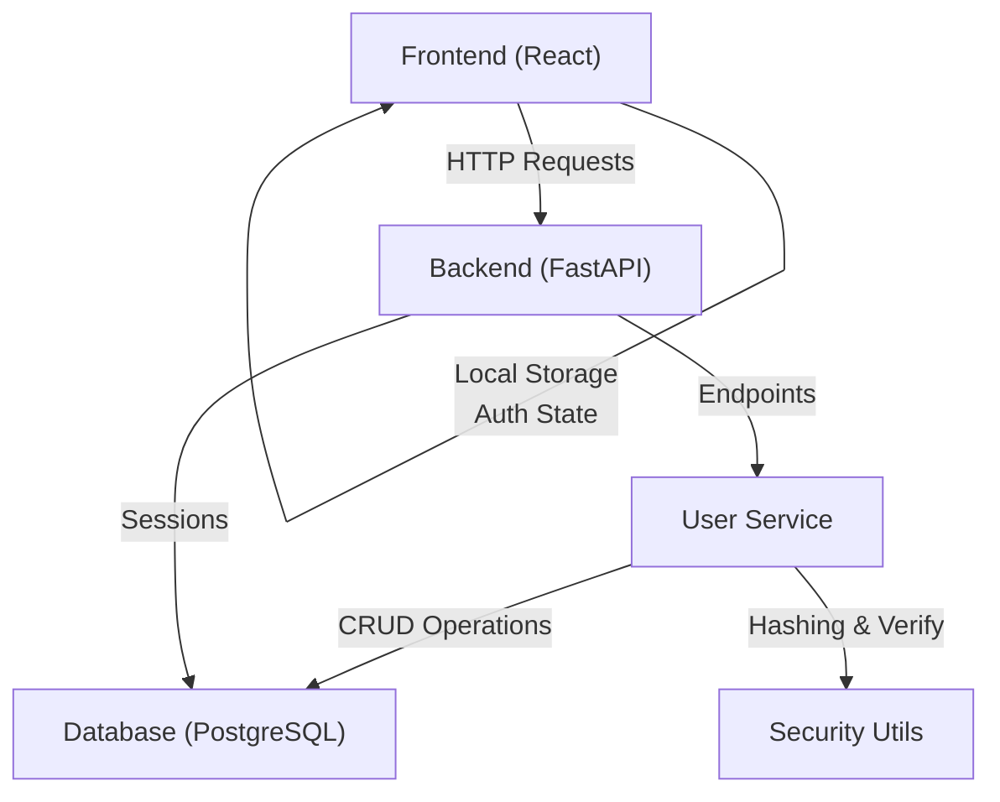

**Diagram sources**
- [AuthContext.tsx:20-41](file://src/contexts/AuthContext.tsx#L20-L41)
- [users.py:19-53](file://backend/app/api/v1/endpoints/users.py#L19-L53)
- [user_service.py:18-35](file://backend/app/services/user_service.py#L18-L35)
- [session.py:32-53](file://backend/app/db/session.py#L32-L53)
- [security.py:17-24](file://backend/app/utils/security.py#L17-L24)

## Detailed Component Analysis

### Frontend Authentication Context
- Purpose: Centralized authentication state and actions.
- State: Stores user object and derived authentication flag.
- Persistence: Writes/reads user object to/from local storage.
- Hook: Validates context consumer is wrapped by provider.

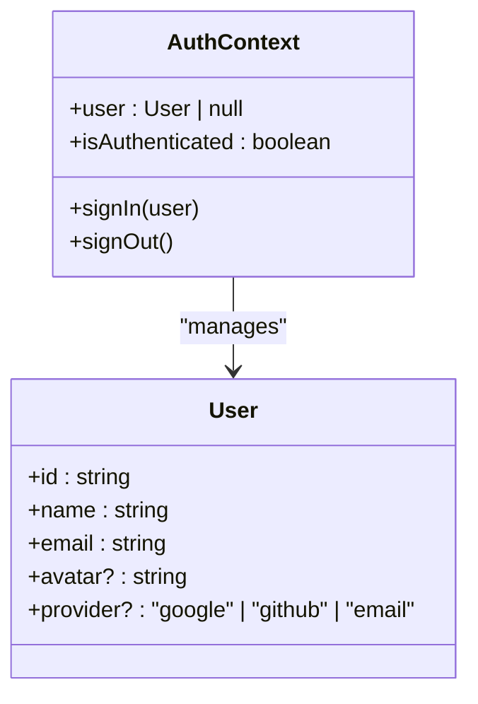

**Diagram sources**
- [AuthContext.tsx:3-16](file://src/contexts/AuthContext.tsx#L3-L16)
- [AuthContext.tsx:20-41](file://src/contexts/AuthContext.tsx#L20-L41)

**Section sources**
- [AuthContext.tsx:3-16](file://src/contexts/AuthContext.tsx#L3-L16)
- [AuthContext.tsx:20-41](file://src/contexts/AuthContext.tsx#L20-L41)

### Login Flow (Frontend)
- Email/Password: Submits credentials to a mock sign-in; on success, persists user and navigates to profile.
- OAuth: Emulates Google and GitHub sign-in by generating a temporary user and persisting it.

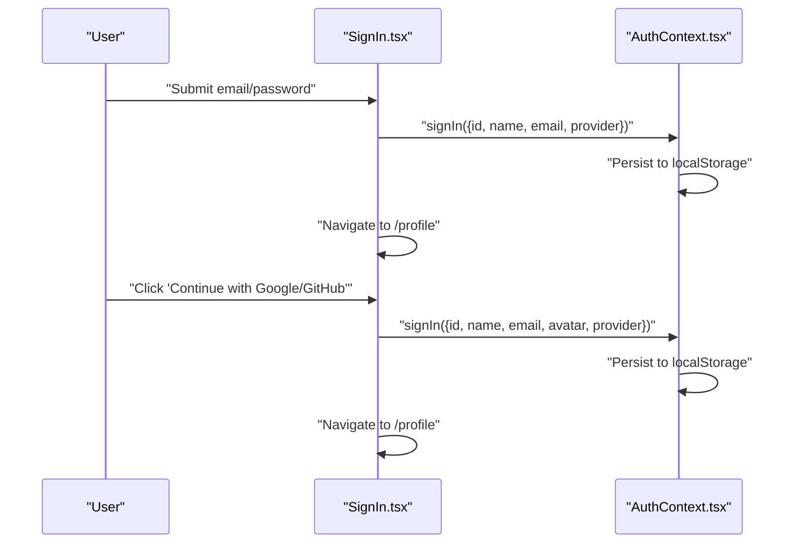

**Diagram sources**
- [SignIn.tsx:14-36](file://src/pages/SignIn.tsx#L14-L36)
- [AuthContext.tsx:26-34](file://src/contexts/AuthContext.tsx#L26-L34)

**Section sources**
- [SignIn.tsx:14-36](file://src/pages/SignIn.tsx#L14-L36)
- [AuthContext.tsx:26-34](file://src/contexts/AuthContext.tsx#L26-L34)

### Backend User Service and Password Hashing
- Password Hashing: Hashes passwords during user creation and updates.
- Authentication: Retrieves user by email and verifies password against stored hash.
- Validation: Uses Pydantic schemas to enforce field constraints.

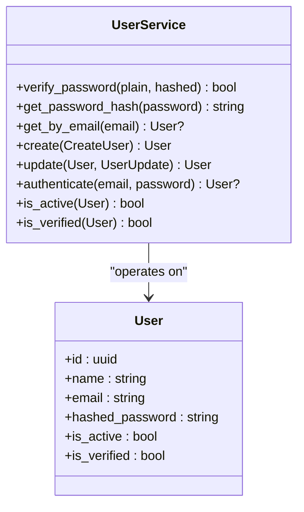

**Diagram sources**
- [user_service.py:18-35](file://backend/app/services/user_service.py#L18-L35)
- [user_service.py:102-118](file://backend/app/services/user_service.py#L102-L118)
- [user.py:13-47](file://backend/app/models/user.py#L13-L47)

**Section sources**
- [user_service.py:18-35](file://backend/app/services/user_service.py#L18-L35)
- [user_service.py:102-118](file://backend/app/services/user_service.py#L102-L118)
- [user.py:13-47](file://backend/app/models/user.py#L13-L47)

### Token-Based Authentication Utilities
- Access Token: Encodes subject, expiration, type, and timestamps; configurable expiration.
- Refresh Token: Similar structure with longer expiration.
- Token Verification: Decodes and validates tokens; ensures token type matches expected type.

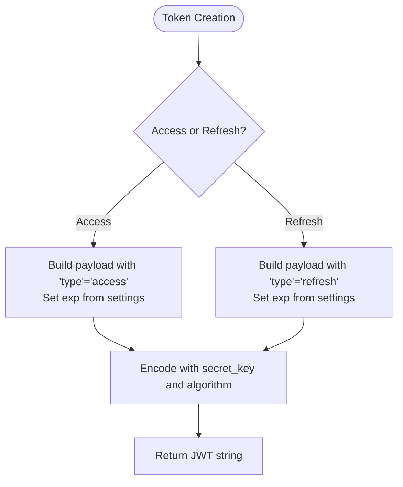

**Diagram sources**
- [security.py:27-90](file://backend/app/utils/security.py#L27-L90)
- [config.py:55-59](file://backend/app/core/config.py#L55-L59)

**Section sources**
- [security.py:27-90](file://backend/app/utils/security.py#L27-L90)
- [config.py:55-59](file://backend/app/core/config.py#L55-L59)

### User Registration Endpoint Flow
- Validates uniqueness of email.
- Hashes password and creates user.
- Returns created user with appropriate status.

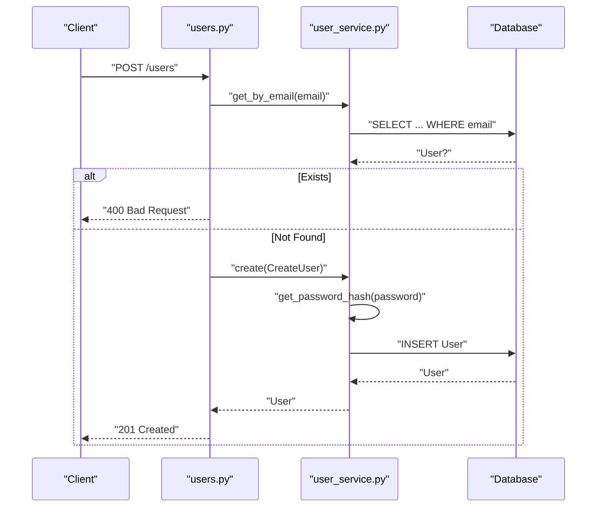

**Diagram sources**
- [users.py:33-53](file://backend/app/api/v1/endpoints/users.py#L33-L53)
- [user_service.py:51-74](file://backend/app/services/user_service.py#L51-L74)
- [user.py:13-47](file://backend/app/models/user.py#L13-L47)

**Section sources**
- [users.py:33-53](file://backend/app/api/v1/endpoints/users.py#L33-L53)
- [user_service.py:51-74](file://backend/app/services/user_service.py#L51-L74)

### Session Management
- Frontend: Maintains user session in memory and local storage; sign-out clears both.
- Backend: No server-side session storage; authentication relies on JWT tokens (not yet implemented in current endpoints).

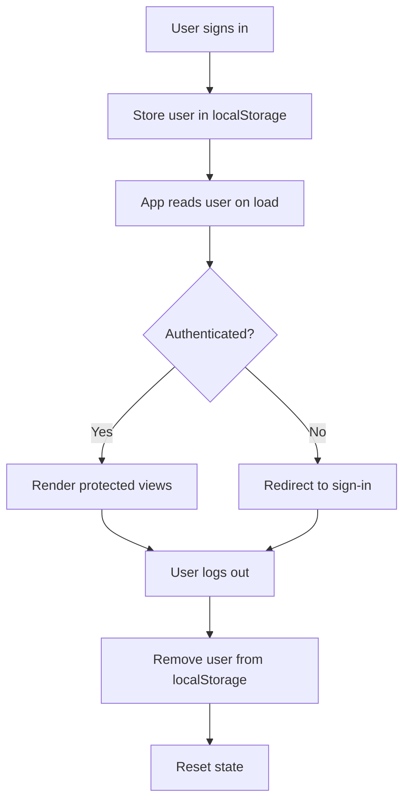

**Diagram sources**
- [AuthContext.tsx:20-41](file://src/contexts/AuthContext.tsx#L20-L41)
- [SignIn.tsx:14-36](file://src/pages/SignIn.tsx#L14-L36)

**Section sources**
- [AuthContext.tsx:20-41](file://src/contexts/AuthContext.tsx#L20-L41)
- [SignIn.tsx:14-36](file://src/pages/SignIn.tsx#L14-L36)

### Authorization and Validation Rules
- User Schema Validation:
  - Email: Required, validated as email.
  - Name: Required, length constraints.
  - Password: Required for creation, length constraints; optional for updates.
- User Update Rules:
  - Optional fields: email, name, password, is_active.
  - Password updates trigger re-hashing.

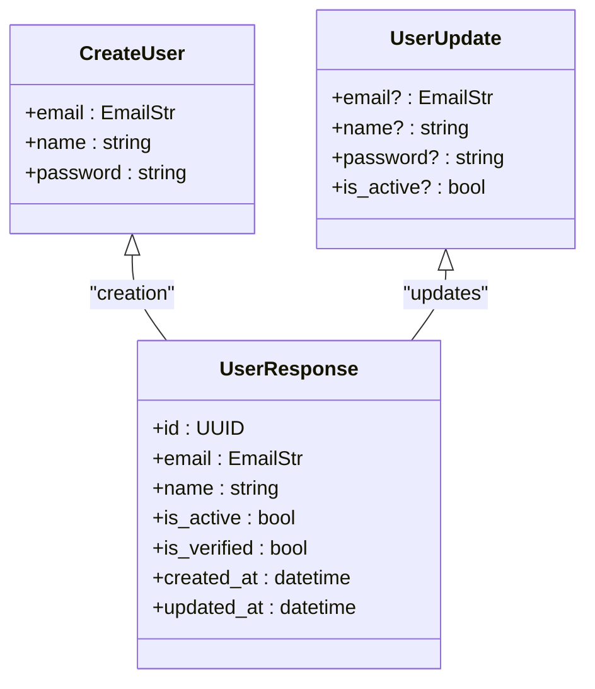

**Diagram sources**
- [user.py:16-31](file://backend/app/schemas/user.py#L16-L31)
- [user.py:35-43](file://backend/app/schemas/user.py#L35-L43)

**Section sources**
- [user.py:16-31](file://backend/app/schemas/user.py#L16-L31)
- [user.py:35-43](file://backend/app/schemas/user.py#L35-L43)

### Error Handling
- User Creation:
  - Duplicate email triggers a 400 error.
- User Retrieval/Deletion:
  - Missing user triggers a 404 error.
- Global Exception Handler:
  - Unhandled exceptions return a standardized 500 response.

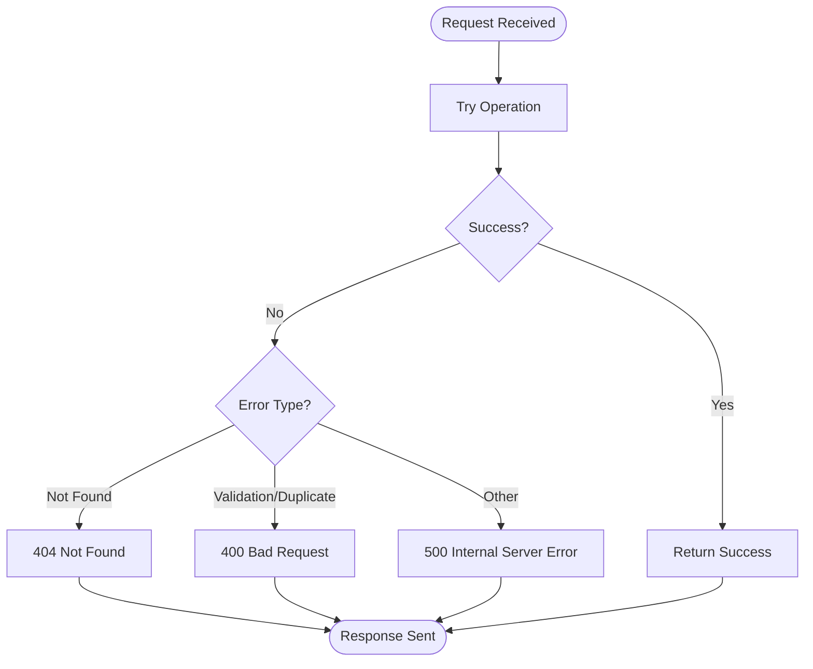

**Diagram sources**
- [users.py:43-53](file://backend/app/api/v1/endpoints/users.py#L43-L53)
- [users.py:67-71](file://backend/app/api/v1/endpoints/users.py#L67-L71)
- [main.py:85-95](file://backend/app/main.py#L85-L95)

**Section sources**
- [users.py:43-53](file://backend/app/api/v1/endpoints/users.py#L43-L53)
- [users.py:67-71](file://backend/app/api/v1/endpoints/users.py#L67-L71)
- [main.py:85-95](file://backend/app/main.py#L85-L95)

## Dependency Analysis
- Frontend
  - App wraps routes with AuthProvider.
  - SignIn uses AuthContext to set user state.
- Backend
  - API router aggregates endpoints and includes users and health.
  - Users endpoint depends on UserService, which depends on the User model and base service.
  - Security utilities depend on configuration for secrets and algorithms.
  - Database session factory provides dependency injection.

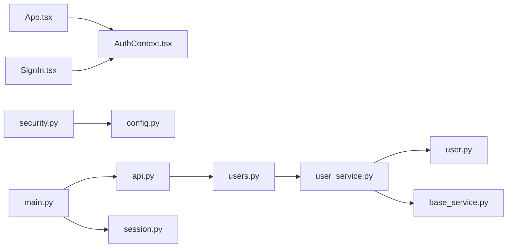

**Diagram sources**
- [App.tsx:14-31](file://src/App.tsx#L14-L31)
- [AuthContext.tsx:20-41](file://src/contexts/AuthContext.tsx#L20-L41)
- [SignIn.tsx:8-24](file://src/pages/SignIn.tsx#L8-L24)
- [api.py:7-13](file://backend/app/api/v1/api.py#L7-L13)
- [users.py:19-53](file://backend/app/api/v1/endpoints/users.py#L19-L53)
- [user_service.py:18-35](file://backend/app/services/user_service.py#L18-L35)
- [user.py:13-47](file://backend/app/models/user.py#L13-L47)
- [base_service.py:19-31](file://backend/app/services/base_service.py#L19-L31)
- [security.py:27-90](file://backend/app/utils/security.py#L27-L90)
- [config.py:55-59](file://backend/app/core/config.py#L55-L59)
- [main.py:49-82](file://backend/app/main.py#L49-L82)
- [session.py:32-53](file://backend/app/db/session.py#L32-L53)

**Section sources**
- [App.tsx:14-31](file://src/App.tsx#L14-L31)
- [api.py:7-13](file://backend/app/api/v1/api.py#L7-L13)
- [users.py:19-53](file://backend/app/api/v1/endpoints/users.py#L19-L53)
- [user_service.py:18-35](file://backend/app/services/user_service.py#L18-L35)
- [security.py:27-90](file://backend/app/utils/security.py#L27-L90)
- [config.py:55-59](file://backend/app/core/config.py#L55-L59)
- [main.py:49-82](file://backend/app/main.py#L49-L82)
- [session.py:32-53](file://backend/app/db/session.py#L32-L53)

## Performance Considerations
- Asynchronous Database Operations: Use of async SQLAlchemy minimizes blocking and improves throughput under concurrent load.
- Token Expiration: Configure access and refresh token durations to balance security and UX.
- Password Hashing Cost: bcrypt cost is managed by the hashing context; avoid overly high costs in development to prevent slow operations.
- Caching: Consider caching frequently accessed user metadata while ensuring cache invalidation on updates.
- Network Efficiency: Compress responses with gzip middleware and minimize payload sizes.

[No sources needed since this section provides general guidance]

## Troubleshooting Guide
- Duplicate Email During Registration
  - Symptom: 400 Bad Request indicating user already exists.
  - Resolution: Prompt user to sign in or use another email.

- User Not Found
  - Symptom: 404 Not Found when retrieving/updating/deleting a user.
  - Resolution: Verify the user ID and ensure the user exists.

- Authentication Failure
  - Symptom: Login fails even with correct credentials.
  - Resolution: Confirm password hashing and verification logic; ensure correct email lookup.

- Global Server Errors
  - Symptom: 500 Internal Server Error for unhandled exceptions.
  - Resolution: Check server logs and stack traces; validate environment configuration.

- CORS Issues
  - Symptom: Cross-origin requests blocked.
  - Resolution: Verify allowed origins, methods, and headers in configuration.

- Database Connectivity
  - Symptom: Readiness check indicates database disconnected.
  - Resolution: Confirm database URL, credentials, and network connectivity.

**Section sources**
- [users.py:43-53](file://backend/app/api/v1/endpoints/users.py#L43-L53)
- [users.py:67-71](file://backend/app/api/v1/endpoints/users.py#L67-L71)
- [main.py:85-95](file://backend/app/main.py#L85-L95)
- [health.py:24-44](file://backend/app/api/v1/endpoints/health.py#L24-L44)

## Conclusion
The authentication system combines a React-based frontend with a robust FastAPI backend. The frontend manages local session state and user persistence, while the backend enforces validation, handles password hashing, and provides a service layer for user operations. Security utilities support token-based authentication, and configuration centralizes sensitive settings. While the current endpoints focus on user management, the architecture supports extending to full token-based authentication flows with minimal changes.