# Backend Architecture

<cite>
**Referenced Files in This Document**
- [app/main.py](file://backend/app/main.py)
- [app/__init__.py](file://backend/app/__init__.py)
- [app/api/v1/api.py](file://backend/app/api/v1/api.py)
- [app/db/session.py](file://backend/app/db/session.py)
- [app/core/config.py](file://backend/app/core/config.py)
- [app/core/logging.py](file://backend/app/core/logging.py)
- [app/api/v1/endpoints/users.py](file://backend/app/api/v1/endpoints/users.py)
- [app/services/base_service.py](file://backend/app/services/base_service.py)
- [app/models/user.py](file://backend/app/models/user.py)
- [app/schemas/user.py](file://backend/app/schemas/user.py)
- [app/services/user_service.py](file://backend/app/services/user_service.py)
- [app/utils/security.py](file://backend/app/utils/security.py)
- [run.py](file://backend/run.py)
- [requirements.txt](file://backend/requirements.txt)
- [alembic/env.py](file://backend/alembic/env.py)
- [tests/test_health.py](file://backend/tests/test_health.py)
</cite>

## Table of Contents
1. [Introduction](#introduction)
2. [Project Structure](#project-structure)
3. [Core Components](#core-components)
4. [Architecture Overview](#architecture-overview)
5. [Detailed Component Analysis](#detailed-component-analysis)
6. [Dependency Analysis](#dependency-analysis)
7. [Performance Considerations](#performance-considerations)
8. [Troubleshooting Guide](#troubleshooting-guide)
9. [Conclusion](#conclusion)
10. [Appendices](#appendices)

## Introduction
This document describes the backend architecture of a FastAPI application. It covers the application factory pattern, modular API structure, middleware configuration, database layer with SQLAlchemy ORM and async sessions, migration strategy with Alembic, service layer architecture, dependency injection patterns, error handling mechanisms, configuration and logging management, security implementations, and the application lifecycle including startup and shutdown. It also includes guidance on scalability, performance optimization, and production deployment requirements.

## Project Structure
The backend follows a layered, modular structure:
- Application factory and lifecycle in app/main.py
- Versioned API in app/api/v1 with modular endpoint aggregation
- Core configuration and logging in app/core
- Database layer with async SQLAlchemy in app/db
- Domain models in app/models
- Pydantic schemas in app/schemas
- Services in app/services implementing business logic
- Security utilities in app/utils
- Development runner in run.py
- Migration configuration in alembic/env.py
- Tests in backend/tests

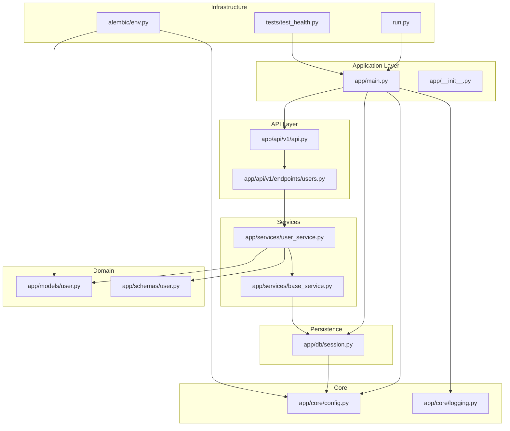

**Diagram sources**
- [app/main.py:1-116](file://backend/app/main.py#L1-L116)
- [app/api/v1/api.py:1-14](file://backend/app/api/v1/api.py#L1-L14)
- [app/api/v1/endpoints/users.py:1-119](file://backend/app/api/v1/endpoints/users.py#L1-L119)
- [app/services/base_service.py:1-152](file://backend/app/services/base_service.py#L1-L152)
- [app/services/user_service.py:1-127](file://backend/app/services/user_service.py#L1-L127)
- [app/models/user.py:1-50](file://backend/app/models/user.py#L1-L50)
- [app/schemas/user.py:1-49](file://backend/app/schemas/user.py#L1-L49)
- [app/db/session.py:1-54](file://backend/app/db/session.py#L1-L54)
- [app/core/config.py:1-131](file://backend/app/core/config.py#L1-L131)
- [app/core/logging.py:1-142](file://backend/app/core/logging.py#L1-L142)
- [run.py:1-19](file://backend/run.py#L1-L19)
- [alembic/env.py:1-103](file://backend/alembic/env.py#L1-L103)
- [tests/test_health.py](file://backend/tests/test_health.py)

**Section sources**
- [app/main.py:1-116](file://backend/app/main.py#L1-L116)
- [app/api/v1/api.py:1-14](file://backend/app/api/v1/api.py#L1-L14)
- [app/core/config.py:1-131](file://backend/app/core/config.py#L1-L131)

## Core Components
- Application factory and lifecycle: The create_application function builds the FastAPI app with environment-aware settings, middleware, routers, and lifespan handlers for startup/shutdown.
- Middleware stack: CORS, GZip compression, and global exception handling.
- Configuration management: Centralized settings via Pydantic Settings with environment variable loading and computed fields for derived values.
- Logging: Structured JSON logging with console and rotating file handlers, plus colored console formatting in development.
- Database layer: Async SQLAlchemy engine and session factory with dependency injection for FastAPI.
- Service layer: Generic BaseService for CRUD operations and UserService for domain-specific logic.
- Security utilities: Password hashing, JWT token creation/verification, and token expiration controls.
- API versioning: Modular v1 endpoints aggregated under a single router.

**Section sources**
- [app/main.py:49-82](file://backend/app/main.py#L49-L82)
- [app/main.py:85-95](file://backend/app/main.py#L85-L95)
- [app/core/config.py:11-131](file://backend/app/core/config.py#L11-L131)
- [app/core/logging.py:68-128](file://backend/app/core/logging.py#L68-L128)
- [app/db/session.py:14-54](file://backend/app/db/session.py#L14-L54)
- [app/services/base_service.py:19-152](file://backend/app/services/base_service.py#L19-L152)
- [app/services/user_service.py:18-127](file://backend/app/services/user_service.py#L18-L127)
- [app/utils/security.py:17-98](file://backend/app/utils/security.py#L17-L98)
- [app/api/v1/api.py:1-14](file://backend/app/api/v1/api.py#L1-L14)

## Architecture Overview
The system uses an application factory pattern to construct the FastAPI app, injects middleware, mounts versioned API routers, and manages database sessions via dependency injection. Lifespan handlers manage logging setup, optional table creation in development, and cleanup on shutdown. The service layer encapsulates business logic and coordinates with SQLAlchemy models and schemas.

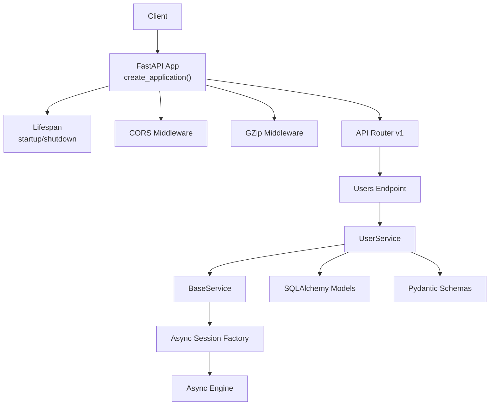

**Diagram sources**
- [app/main.py:49-82](file://backend/app/main.py#L49-L82)
- [app/api/v1/api.py:1-14](file://backend/app/api/v1/api.py#L1-L14)
- [app/api/v1/endpoints/users.py:1-119](file://backend/app/api/v1/endpoints/users.py#L1-L119)
- [app/services/user_service.py:18-127](file://backend/app/services/user_service.py#L18-L127)
- [app/services/base_service.py:19-152](file://backend/app/services/base_service.py#L19-L152)
- [app/db/session.py:14-54](file://backend/app/db/session.py#L14-L54)

## Detailed Component Analysis

### Application Factory and Lifecycle
- Factory function constructs the FastAPI app with environment-aware docs/redoc/OpenAPI visibility and sets lifespan.
- Lifespan handles logging initialization, optional development table creation, and engine disposal on shutdown.
- Global exception handler centralizes error responses.

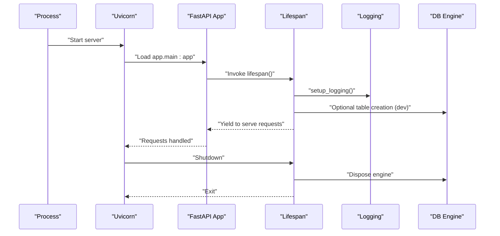

**Diagram sources**
- [app/main.py:22-46](file://backend/app/main.py#L22-L46)
- [app/main.py:49-82](file://backend/app/main.py#L49-L82)
- [app/core/logging.py:68-128](file://backend/app/core/logging.py#L68-L128)
- [app/db/session.py:14-20](file://backend/app/db/session.py#L14-L20)

**Section sources**
- [app/main.py:22-46](file://backend/app/main.py#L22-L46)
- [app/main.py:49-82](file://backend/app/main.py#L49-L82)
- [app/main.py:85-95](file://backend/app/main.py#L85-L95)

### Middleware Configuration
- CORS: Controlled via settings with origins, methods, headers, and credentials.
- GZip: Enabled with a minimum size threshold for compression.
- Docs visibility: Hidden in production for security and cleaner deployments.

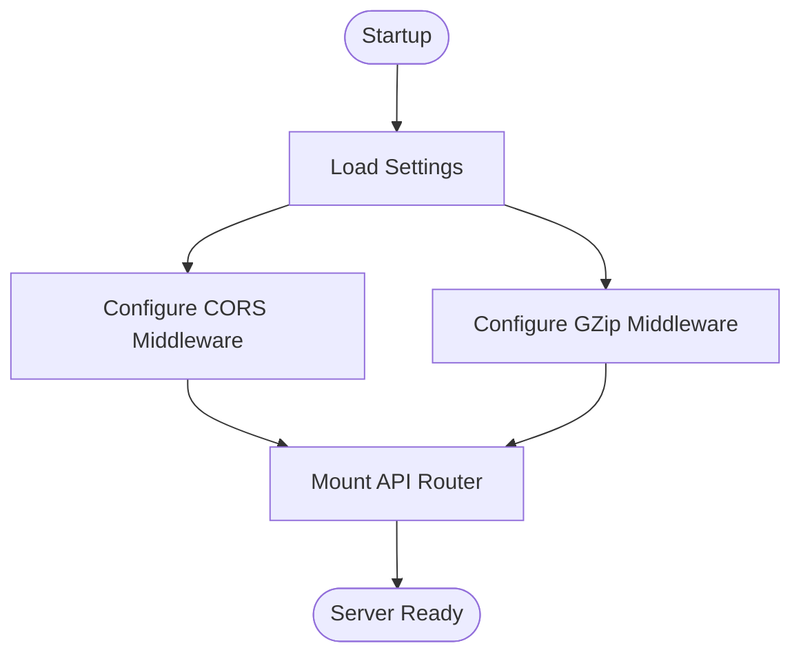

**Diagram sources**
- [app/main.py:64-77](file://backend/app/main.py#L64-L77)
- [app/core/config.py:40-60](file://backend/app/core/config.py#L40-L60)

**Section sources**
- [app/main.py:64-77](file://backend/app/main.py#L64-L77)
- [app/core/config.py:40-60](file://backend/app/core/config.py#L40-L60)

### Database Layer and Session Management
- Async engine configured from settings with optional echo and pool behavior.
- Async session factory with explicit commit/rollback and close semantics.
- Dependency injection via get_db for FastAPI endpoints.

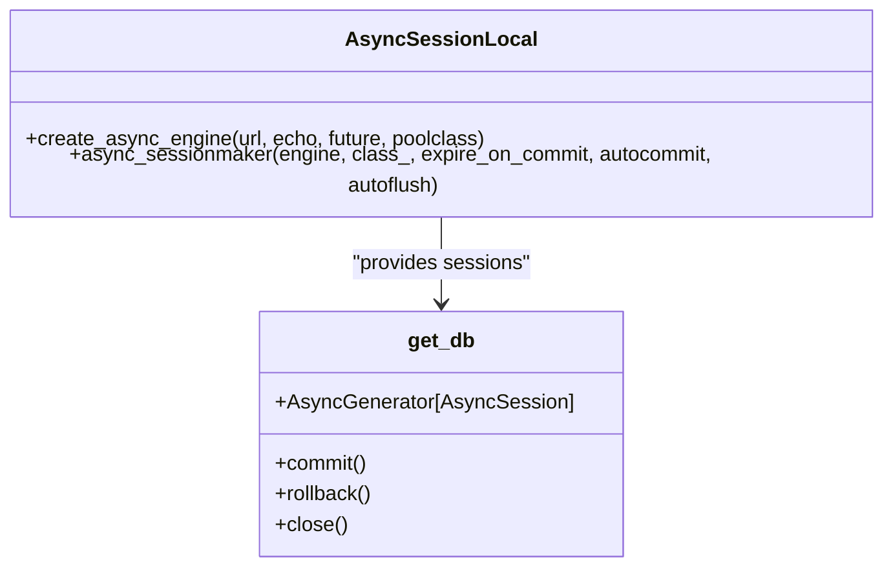

**Diagram sources**
- [app/db/session.py:14-54](file://backend/app/db/session.py#L14-L54)

**Section sources**
- [app/db/session.py:14-54](file://backend/app/db/session.py#L14-L54)
- [app/core/config.py:73-91](file://backend/app/core/config.py#L73-L91)

### Migration Strategy with Alembic
- Alembic environment loads settings and sets the sync database URL for migrations.
- Imports models for detection and supports offline/online async migrations.

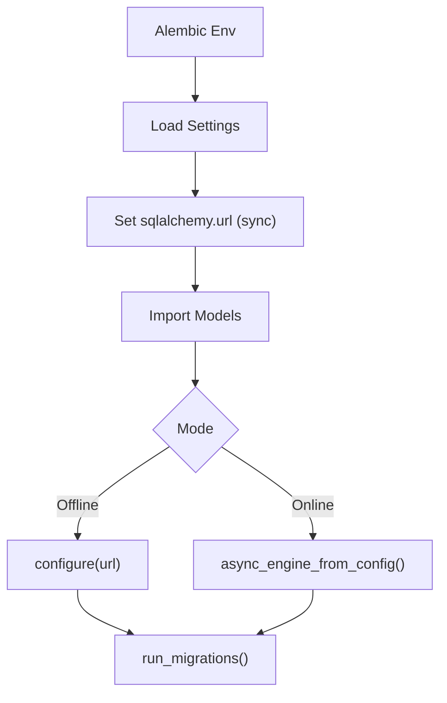

**Diagram sources**
- [alembic/env.py:20-103](file://backend/alembic/env.py#L20-L103)
- [app/core/config.py:86-91](file://backend/app/core/config.py#L86-L91)

**Section sources**
- [alembic/env.py:20-103](file://backend/alembic/env.py#L20-L103)
- [app/core/config.py:86-91](file://backend/app/core/config.py#L86-L91)

### Service Layer Architecture and Dependency Injection
- BaseService provides generic CRUD operations with type variables for models and schemas.
- UserService extends BaseService with domain logic (password hashing, authentication checks).
- Endpoints depend on UserService and receive AsyncSession via get_db.

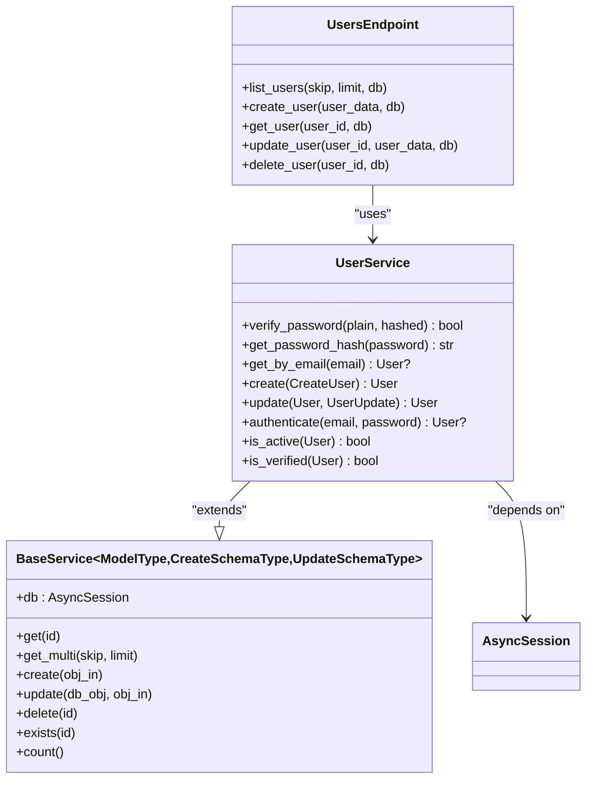

**Diagram sources**
- [app/services/base_service.py:19-152](file://backend/app/services/base_service.py#L19-L152)
- [app/services/user_service.py:18-127](file://backend/app/services/user_service.py#L18-L127)
- [app/api/v1/endpoints/users.py:19-119](file://backend/app/api/v1/endpoints/users.py#L19-L119)
- [app/db/session.py:32-54](file://backend/app/db/session.py#L32-L54)

**Section sources**
- [app/services/base_service.py:19-152](file://backend/app/services/base_service.py#L19-L152)
- [app/services/user_service.py:18-127](file://backend/app/services/user_service.py#L18-L127)
- [app/api/v1/endpoints/users.py:19-119](file://backend/app/api/v1/endpoints/users.py#L19-L119)

### Error Handling Mechanisms
- Global exception handler returns standardized JSON responses with contextual details.
- Endpoint-level HTTP exceptions provide precise failure semantics.

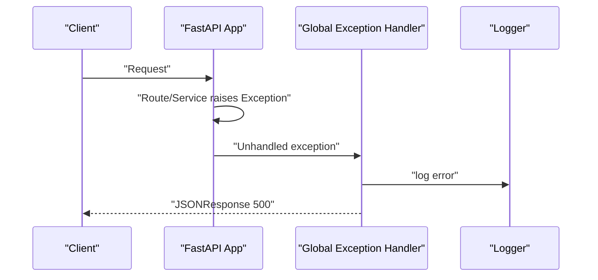

**Diagram sources**
- [app/main.py:85-95](file://backend/app/main.py#L85-L95)
- [app/core/logging.py:68-128](file://backend/app/core/logging.py#L68-L128)

**Section sources**
- [app/main.py:85-95](file://backend/app/main.py#L85-L95)

### Configuration Management
- Settings loaded from environment variables with Pydantic Settings.
- Computed fields derive async/sync database URLs, lists for CORS, and environment flags.
- Caching via LRU cache for efficient retrieval.

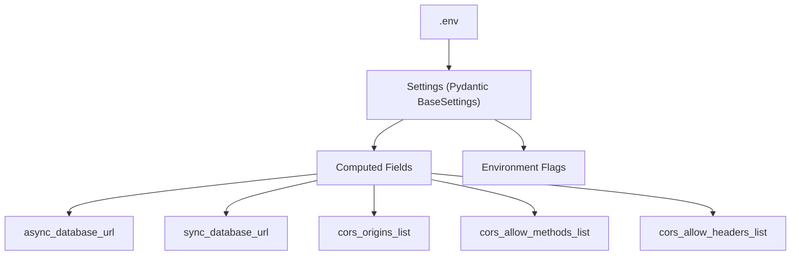

**Diagram sources**
- [app/core/config.py:11-131](file://backend/app/core/config.py#L11-L131)

**Section sources**
- [app/core/config.py:11-131](file://backend/app/core/config.py#L11-L131)

### Logging Setup
- Structured JSON logging for production with rotating file handler.
- Colored console formatter for development.
- Third-party library noise reduced via logger level tuning.

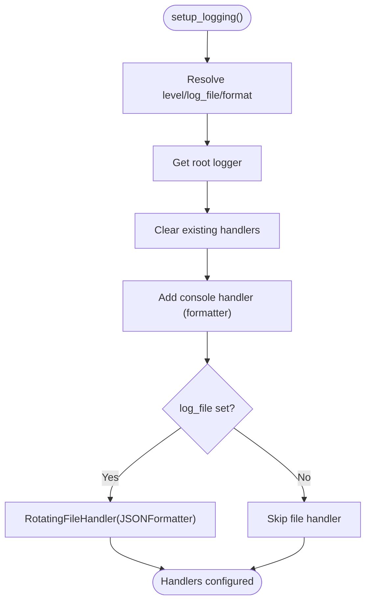

**Diagram sources**
- [app/core/logging.py:68-128](file://backend/app/core/logging.py#L68-L128)

**Section sources**
- [app/core/logging.py:68-128](file://backend/app/core/logging.py#L68-L128)

### Security Implementations
- Password hashing with bcrypt via passlib.
- JWT token creation/refresh with configurable expiration and signing algorithm.
- Token decoding with error handling.

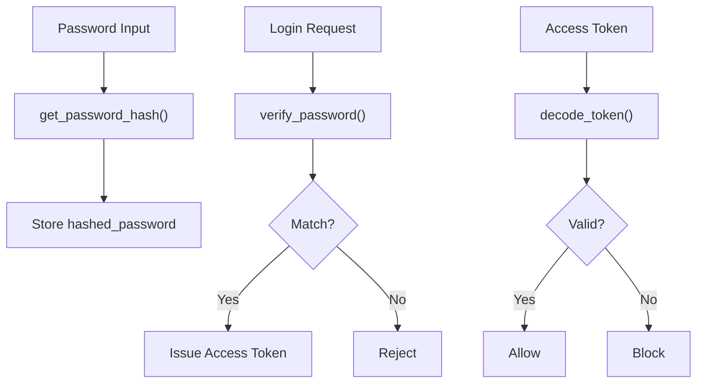

**Diagram sources**
- [app/utils/security.py:17-98](file://backend/app/utils/security.py#L17-L98)
- [app/services/user_service.py:26-34](file://backend/app/services/user_service.py#L26-L34)

**Section sources**
- [app/utils/security.py:17-98](file://backend/app/utils/security.py#L17-L98)
- [app/services/user_service.py:26-34](file://backend/app/services/user_service.py#L26-L34)

### Application Lifecycle, Startup, and Shutdown
- Startup: Logging initialized, optional development table creation, router mounted.
- Runtime: Requests served through endpoints using injected services and sessions.
- Shutdown: Engine disposed to release connections.

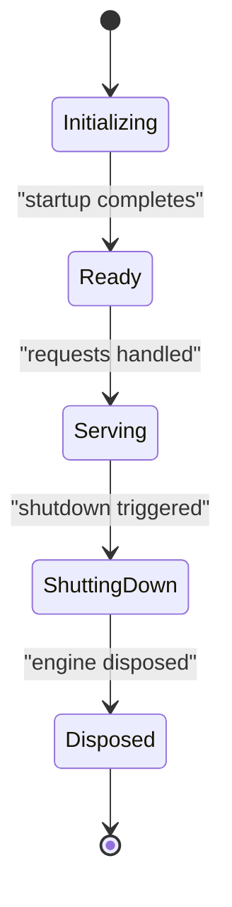

**Diagram sources**
- [app/main.py:22-46](file://backend/app/main.py#L22-L46)
- [app/db/session.py:45-54](file://backend/app/db/session.py#L45-L54)

**Section sources**
- [app/main.py:22-46](file://backend/app/main.py#L22-L46)
- [app/db/session.py:45-54](file://backend/app/db/session.py#L45-L54)

## Dependency Analysis
External dependencies include FastAPI, Uvicorn, SQLAlchemy asyncio, Alembic, Pydantic settings, python-jose/cryptography, passlib/bcrypt, and development/testing tools. These are declared in requirements.txt.

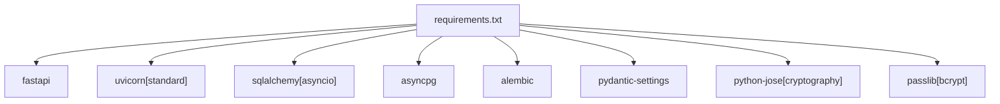

**Diagram sources**
- [requirements.txt:1-39](file://backend/requirements.txt#L1-L39)

**Section sources**
- [requirements.txt:1-39](file://backend/requirements.txt#L1-L39)

## Performance Considerations
- Use async SQLAlchemy for non-blocking I/O.
- Enable GZip middleware to reduce payload sizes.
- Tune CORS settings to minimize preflight overhead.
- Use pagination parameters to limit result sizes.
- Prefer bulk operations where appropriate and avoid N+1 queries.
- Monitor and tune database connection pooling.
- Use structured logging for observability and reduce noisy third-party logs.

## Troubleshooting Guide
- Health check endpoint: Verify application availability at /health.
- Environment variables: Ensure .env is present and settings are correctly loaded.
- Database connectivity: Confirm async database URL and credentials.
- Logging: Check log file path and format; verify rotating file handler configuration.
- Exceptions: Review global exception handler output and logs for unhandled errors.

**Section sources**
- [app/main.py:98-116](file://backend/app/main.py#L98-L116)
- [app/core/config.py:11-131](file://backend/app/core/config.py#L11-L131)
- [app/core/logging.py:68-128](file://backend/app/core/logging.py#L68-L128)
- [tests/test_health.py](file://backend/tests/test_health.py)

## Conclusion
The backend employs a clean, modular FastAPI architecture with an application factory, robust configuration and logging, async database operations, typed schemas, a generic service layer, and comprehensive security utilities. Alembic migrations support schema evolution, while middleware and lifecycle management ensure reliable operation across environments.

## Appendices

### API Endpoints Overview
- GET /: Application metadata and docs availability
- GET /health: Health check
- GET /api/v1/users: List users with pagination
- POST /api/v1/users: Create user
- GET /api/v1/users/{user_id}: Retrieve user
- PUT /api/v1/users/{user_id}: Update user
- DELETE /api/v1/users/{user_id}: Delete user

**Section sources**
- [app/main.py:98-116](file://backend/app/main.py#L98-L116)
- [app/api/v1/api.py:11-13](file://backend/app/api/v1/api.py#L11-L13)
- [app/api/v1/endpoints/users.py:19-119](file://backend/app/api/v1/endpoints/users.py#L19-L119)