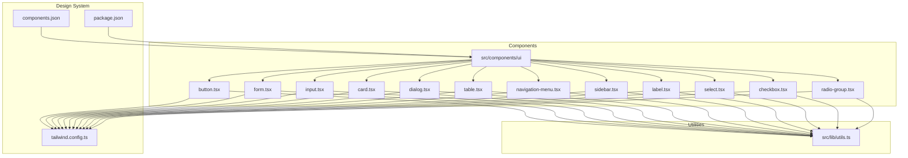
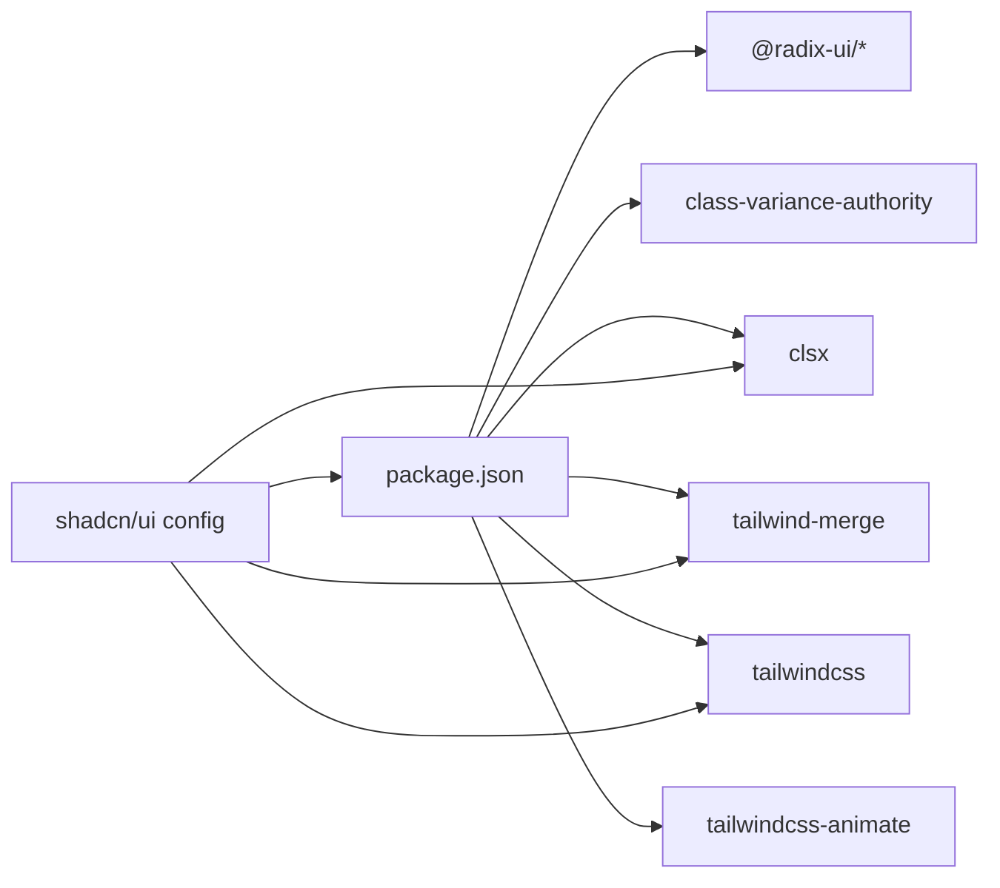

# Component Library

<cite>
**Referenced Files in This Document**
- [button.tsx](file://src/components/ui/button.tsx)
- [form.tsx](file://src/components/ui/form.tsx)
- [input.tsx](file://src/components/ui/input.tsx)
- [card.tsx](file://src/components/ui/card.tsx)
- [dialog.tsx](file://src/components/ui/dialog.tsx)
- [table.tsx](file://src/components/ui/table.tsx)
- [navigation-menu.tsx](file://src/components/ui/navigation-menu.tsx)
- [sidebar.tsx](file://src/components/ui/sidebar.tsx)
- [label.tsx](file://src/components/ui/label.tsx)
- [select.tsx](file://src/components/ui/select.tsx)
- [checkbox.tsx](file://src/components/ui/checkbox.tsx)
- [radio-group.tsx](file://src/components/ui/radio-group.tsx)
- [utils.ts](file://src/lib/utils.ts)
- [tailwind.config.ts](file://tailwind.config.ts)
- [components.json](file://components.json)
- [package.json](file://package.json)
</cite>

## Table of Contents
1. [Introduction](#introduction)
2. [Project Structure](#project-structure)
3. [Core Components](#core-components)
4. [Architecture Overview](#architecture-overview)
5. [Detailed Component Analysis](#detailed-component-analysis)
6. [Dependency Analysis](#dependency-analysis)
7. [Performance Considerations](#performance-considerations)
8. [Accessibility Features](#accessibility-features)
9. [Cross-Browser Compatibility](#cross-browser-compatibility)
10. [Extending the Component Library](#extending-the-component-library)
11. [Troubleshooting Guide](#troubleshooting-guide)
12. [Conclusion](#conclusion)

## Introduction
This document describes the UI component library and design system used in the project. It explains how shadcn/ui is integrated, how components are composed and customized, and how the design tokens and theme are applied. It documents key components (buttons, forms, inputs, navigation, layout, tables, dialogs, selects, checkboxes, radios) with their props, customization options, and usage patterns. It also covers accessibility, responsive design, performance, and extension guidelines.

## Project Structure
The component library is organized under src/components/ui with individual components grouped by function. Shared utilities live under src/lib, and the design system is configured via Tailwind CSS and a JSON configuration for shadcn/ui.

**Diagram sources**
- [button.tsx](file://src/components/ui/button.tsx)
- [form.tsx](file://src/components/ui/form.tsx)
- [input.tsx](file://src/components/ui/input.tsx)
- [card.tsx](file://src/components/ui/card.tsx)
- [dialog.tsx](file://src/components/ui/dialog.tsx)
- [table.tsx](file://src/components/ui/table.tsx)
- [navigation-menu.tsx](file://src/components/ui/navigation-menu.tsx)
- [sidebar.tsx](file://src/components/ui/sidebar.tsx)
- [label.tsx](file://src/components/ui/label.tsx)
- [select.tsx](file://src/components/ui/select.tsx)
- [checkbox.tsx](file://src/components/ui/checkbox.tsx)
- [radio-group.tsx](file://src/components/ui/radio-group.tsx)
- [utils.ts](file://src/lib/utils.ts)
- [tailwind.config.ts](file://tailwind.config.ts)
- [components.json](file://components.json)
- [package.json](file://package.json)

**Section sources**
- [button.tsx](file://src/components/ui/button.tsx)
- [form.tsx](file://src/components/ui/form.tsx)
- [input.tsx](file://src/components/ui/input.tsx)
- [card.tsx](file://src/components/ui/card.tsx)
- [dialog.tsx](file://src/components/ui/dialog.tsx)
- [table.tsx](file://src/components/ui/table.tsx)
- [navigation-menu.tsx](file://src/components/ui/navigation-menu.tsx)
- [sidebar.tsx](file://src/components/ui/sidebar.tsx)
- [label.tsx](file://src/components/ui/label.tsx)
- [select.tsx](file://src/components/ui/select.tsx)
- [checkbox.tsx](file://src/components/ui/checkbox.tsx)
- [radio-group.tsx](file://src/components/ui/radio-group.tsx)
- [utils.ts](file://src/lib/utils.ts)
- [tailwind.config.ts](file://tailwind.config.ts)
- [components.json](file://components.json)
- [package.json](file://package.json)

## Core Components
This section summarizes the core building blocks and their roles in the design system.

- Design tokens and theme
  - Tailwind is configured with CSS variables for semantic colors, typography, radii, and animations. Dark mode is supported via a class strategy.
  - The design system defines tokens for backgrounds, borders, rings, primary/accent palettes, and specialized areas like the sidebar.

- Utility functions
  - A single cn(...) utility merges and deduplicates Tailwind classes, ensuring predictable overrides and minimal CSS output.

- shadcn/ui integration
  - The project uses shadcn/ui with a TSX-first setup, a local alias for components, and CSS variables enabled for theme consistency.

**Section sources**
- [tailwind.config.ts](file://tailwind.config.ts)
- [utils.ts](file://src/lib/utils.ts)
- [components.json](file://components.json)

## Architecture Overview
The component library follows a composition pattern:
- Base primitives (Radix UI) provide accessible, unstyled foundations.
- Components apply design tokens via Tailwind classes and optional variant systems.
- Utilities merge classes safely and consistently.
- Forms integrate with react-hook-form and Radix labels for accessibility.

```mermaid
graph TB
PRIM["Radix UI Primitives<br/>@radix-ui/*"]
UTIL["Utility Layer<br/>cn(...)"]
THEME["Tailwind Theme<br/>CSS Variables"]
SHAD["shadcn/ui Config<br/>components.json"]
BTN["Button"]
INPUT["Input"]
FORM["Form Fields<br/>Form/FormLabel/FormControl/etc."]
SELECT["Select"]
CHECK["Checkbox"]
RADIO["RadioGroup/RadioGroupItem"]
CARD["Card"]
DIALOG["Dialog"]
TABLE["Table"]
NAV["NavigationMenu"]
SBAR["Sidebar"]
PRIM --> BTN
PRIM --> INPUT
PRIM --> FORM
PRIM --> SELECT
PRIM --> CHECK
PRIM --> RADIO
PRIM --> CARD
PRIM --> DIALOG
PRIM --> TABLE
PRIM --> NAV
PRIM --> SBAR
UTIL --> BTN
UTIL --> INPUT
UTIL --> FORM
UTIL --> SELECT
UTIL --> CHECK
UTIL --> RADIO
UTIL --> CARD
UTIL --> DIALOG
UTIL --> TABLE
UTIL --> NAV
UTIL --> SBAR
THEME --> BTN
THEME --> INPUT
THEME --> FORM
THEME --> SELECT
THEME --> CHECK
THEME --> RADIO
THEME --> CARD
THEME --> DIALOG
THEME --> TABLE
THEME --> NAV
THEME --> SBAR
SHAD --> BTN
SHAD --> INPUT
SHAD --> FORM
SHAD --> SELECT
SHAD --> CHECK
SHAD --> RADIO
SHAD --> CARD
SHAD --> DIALOG
SHAD --> TABLE
SHAD --> NAV
SHAD --> SBAR
```

**Diagram sources**
- [button.tsx](file://src/components/ui/button.tsx)
- [form.tsx](file://src/components/ui/form.tsx)
- [input.tsx](file://src/components/ui/input.tsx)
- [select.tsx](file://src/components/ui/select.tsx)
- [checkbox.tsx](file://src/components/ui/checkbox.tsx)
- [radio-group.tsx](file://src/components/ui/radio-group.tsx)
- [card.tsx](file://src/components/ui/card.tsx)
- [dialog.tsx](file://src/components/ui/dialog.tsx)
- [table.tsx](file://src/components/ui/table.tsx)
- [navigation-menu.tsx](file://src/components/ui/navigation-menu.tsx)
- [sidebar.tsx](file://src/components/ui/sidebar.tsx)
- [utils.ts](file://src/lib/utils.ts)
- [tailwind.config.ts](file://tailwind.config.ts)
- [components.json](file://components.json)

## Detailed Component Analysis

### Button
- Purpose: Primary action element with variants and sizes.
- Variants: default, destructive, outline, secondary, ghost, link.
- Sizes: default, sm, lg, icon.
- Composition: Uses a variant system (cva) and accepts className overrides; supports asChild via Slot for composition.
- Accessibility: Inherits native button semantics; focus-visible ring and disabled states handled.
- Customization: Pass variant and size props; override className for additional styles.

Usage example references:
- [button.tsx](file://src/components/ui/button.tsx)

**Section sources**
- [button.tsx](file://src/components/ui/button.tsx)

### Input
- Purpose: Text input with consistent styling and focus states.
- Behavior: Accepts standard input attributes; applies focus ring and disabled state.
- Responsive: Includes responsive text sizing.

Usage example references:
- [input.tsx](file://src/components/ui/input.tsx)

**Section sources**
- [input.tsx](file://src/components/ui/input.tsx)

### Form System (Form/FormLabel/FormControl/FormMessage/etc.)
- Purpose: Accessible form scaffolding built on react-hook-form and Radix labels.
- Composition:
  - Form wraps react-hook-form’s FormProvider.
  - FormField composes Controller with field context.
  - useFormField reads field state and generates aria-* attributes.
  - FormLabel, FormControl, FormDescription, FormMessage adapt to validation state.
- Accessibility: Proper labeling, aria-invalid, aria-describedby, and error messaging.

Usage example references:
- [form.tsx](file://src/components/ui/form.tsx)

**Section sources**
- [form.tsx](file://src/components/ui/form.tsx)

### Card
- Purpose: Content containers with header, title, description, content, and footer slots.
- Composition: Stateless slot components compose a cohesive card layout.

Usage example references:
- [card.tsx](file://src/components/ui/card.tsx)

**Section sources**
- [card.tsx](file://src/components/ui/card.tsx)

### Dialog
- Purpose: Modal overlay with close controls and portal rendering.
- Composition: Root, Trigger, Portal, Close, Overlay, Content, Header/Footer, Title, Description.
- Animations: Uses data-[state=open] and fade/slide/zoom transitions.
- Accessibility: Focus trapping via Radix, screen-reader-friendly close label.

Usage example references:
- [dialog.tsx](file://src/components/ui/dialog.tsx)

**Section sources**
- [dialog.tsx](file://src/components/ui/dialog.tsx)

### Table
- Purpose: Scrollable, accessible data table with semantic markup.
- Composition: Table wrapper, TableHeader/TableBody/TableFooter, TableRow, TableHead/TableCell, TableCaption.
- Accessibility: Uses proper table semantics and hover/selected states.

Usage example references:
- [table.tsx](file://src/components/ui/table.tsx)

**Section sources**
- [table.tsx](file://src/components/ui/table.tsx)

### NavigationMenu
- Purpose: Multi-level navigation with animated viewport and indicator.
- Composition: Root, List, Item, Trigger (with chevron), Content, Link, Viewport, Indicator.
- Behavior: Active/open states, motion classes, and keyboard-aware interactions.

Usage example references:
- [navigation-menu.tsx](file://src/components/ui/navigation-menu.tsx)

**Section sources**
- [navigation-menu.tsx](file://src/components/ui/navigation-menu.tsx)

### Sidebar
- Purpose: Responsive sidebar with provider, collapsible modes, and nested menu components.
- Modes:
  - Collapsible: offcanvas, icon, none.
  - Variants: sidebar, floating, inset.
  - Mobile: Sheet overlay with cookie persistence.
- Composition: SidebarProvider, Sidebar, SidebarTrigger, SidebarRail, SidebarInset, SidebarHeader/Footer/Content, SidebarGroup/Label/Action/Content, SidebarMenu/Button/Action/Badge/Skeleton/Sub/SubButton/SubItem, SidebarInput, SidebarSeparator.
- Accessibility: Tooltips, keyboard shortcut (Ctrl/Cmd + b), aria-labels, and focus management.

Usage example references:
- [sidebar.tsx](file://src/components/ui/sidebar.tsx)

**Section sources**
- [sidebar.tsx](file://src/components/ui/sidebar.tsx)

### Label
- Purpose: Associated text for form controls with disabled state support.
- Variants: text-sm font-medium; disabled opacity and cursor handling.

Usage example references:
- [label.tsx](file://src/components/ui/label.tsx)

**Section sources**
- [label.tsx](file://src/components/ui/label.tsx)

### Select
- Purpose: Accessible single/multi-select with scrolling and positioning.
- Composition: Root, Group, Value, Trigger, Content (portal), Label, Item, Separator, ScrollUp/Down buttons.
- Behavior: Popper positioning, icons, selection indicators.

Usage example references:
- [select.tsx](file://src/components/ui/select.tsx)

**Section sources**
- [select.tsx](file://src/components/ui/select.tsx)

### Checkbox
- Purpose: Two-state selection with indicator.
- Behavior: Checked state styling and focus ring.

Usage example references:
- [checkbox.tsx](file://src/components/ui/checkbox.tsx)

**Section sources**
- [checkbox.tsx](file://src/components/ui/checkbox.tsx)

### RadioGroup
- Purpose: Single-selection among multiple options.
- Composition: RadioGroup container and RadioGroupItem with indicator.

Usage example references:
- [radio-group.tsx](file://src/components/ui/radio-group.tsx)

**Section sources**
- [radio-group.tsx](file://src/components/ui/radio-group.tsx)

## Dependency Analysis
The component library relies on:
- Radix UI primitives for accessible base components.
- class-variance-authority for variant systems.
- Tailwind CSS and CSS variables for theming.
- shadcn/ui configuration for consistent aliases and TSX support.

**Diagram sources**
- [package.json](file://package.json)
- [components.json](file://components.json)

**Section sources**
- [package.json](file://package.json)
- [components.json](file://components.json)

## Performance Considerations
- Prefer variant props over ad-hoc className merging to reduce runtime computation.
- Use the cn(...) utility to avoid redundant classes and minimize CSS payload.
- Limit heavy animations on low-powered devices; consider prefers-reduced-motion checks where appropriate.
- Defer non-critical resources (e.g., tooltips, overlays) until needed.
- Keep component trees shallow; leverage composition patterns to avoid unnecessary re-renders.

## Accessibility Features
- All interactive components use native HTML semantics where applicable (button, input, label).
- Focus management: focus-visible rings and focus traps in dialogs.
- ARIA attributes: aria-invalid, aria-describedby, role=dialog/checkbox/radio.
- Screen reader support: sr-only labels for close buttons and icons.
- Keyboard navigation: triggers for menus, dialogs, and navigation.

## Cross-Browser Compatibility
- Tailwind utilities and CSS variables are broadly supported; ensure polyfills for older browsers if needed.
- Radix UI primitives are designed for broad compatibility; test with your target browser matrix.
- Avoid experimental CSS features not supported by legacy browsers.

## Extending the Component Library
- Add new components under src/components/ui following existing patterns:
  - Use Radix UI primitives for accessibility.
  - Apply Tailwind classes and CSS variables for theming.
  - Export a variant system (cva) when appropriate.
  - Provide asChild support via Slot for composition.
- Update the design system:
  - Extend tailwind.config.ts with new colors, spacing, or animations.
  - Update components.json aliases if introducing new paths.
- Maintain accessibility:
  - Preserve focus management and ARIA attributes.
  - Provide keyboard shortcuts and screen-reader-friendly labels.

## Troubleshooting Guide
- Styles not applying:
  - Verify Tailwind content globs include your component paths.
  - Confirm CSS variables are present in the theme.
- Variants not working:
  - Ensure cva is imported and used correctly.
  - Check className precedence and that cn(...) merges properly.
- Form errors not visible:
  - Confirm useFormField is used inside FormField/Form.
  - Ensure FormControl receives aria-describedby and aria-invalid.
- Dialog not closing or focus issues:
  - Verify Portal rendering and Close trigger placement.
  - Check that overlay and content classes are applied.

## Conclusion
The component library leverages Radix UI, Tailwind CSS, and shadcn/ui to deliver accessible, themeable, and composable UI elements. By following the documented patterns—variants, composition, accessibility, and responsive design—you can confidently extend and customize the library for diverse product needs.