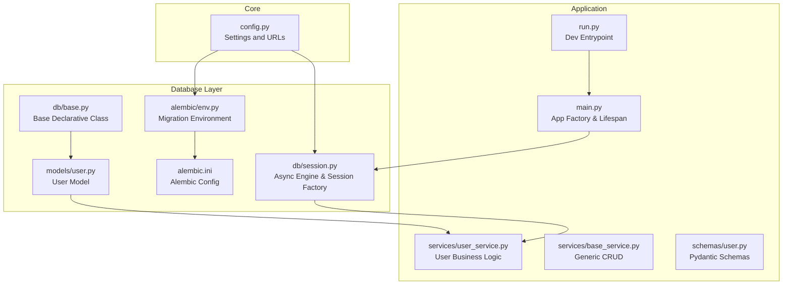
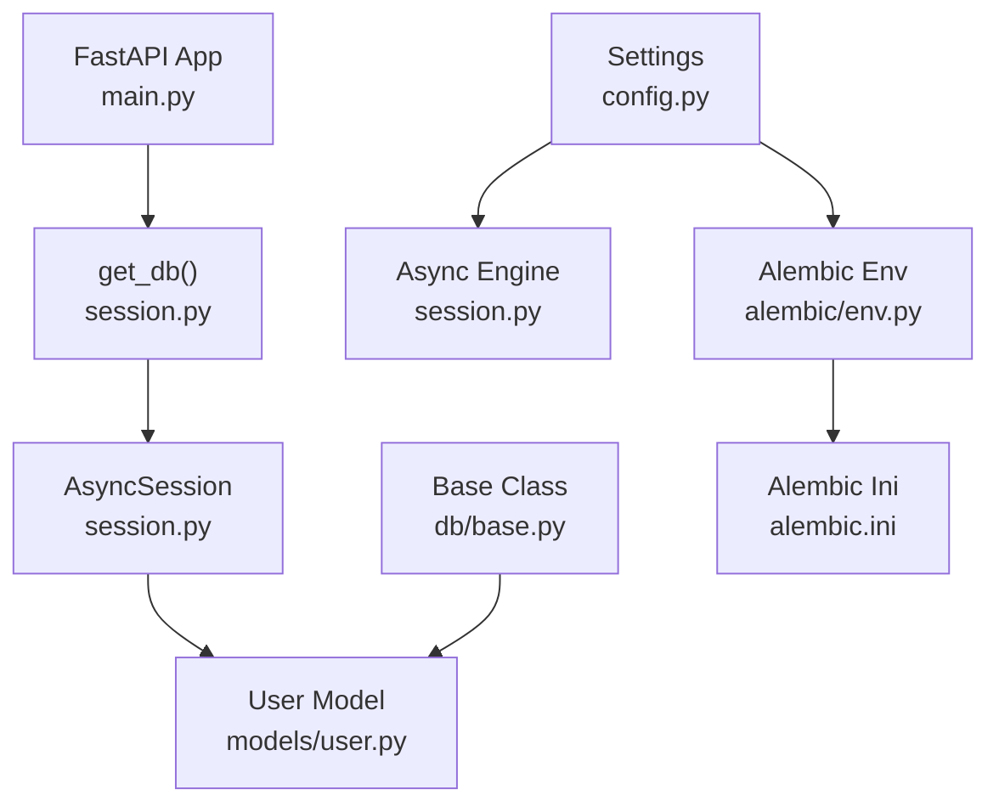
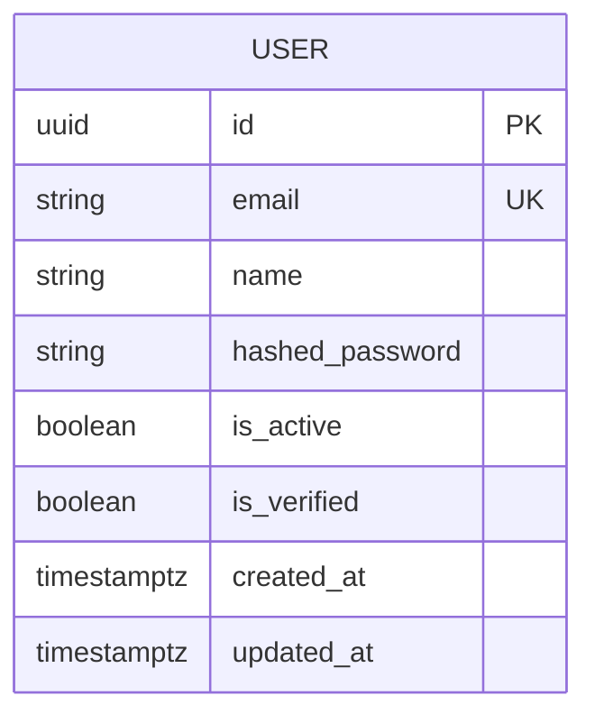
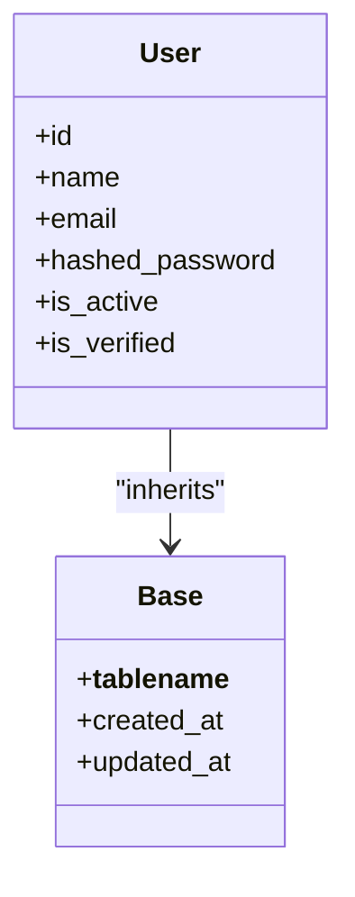
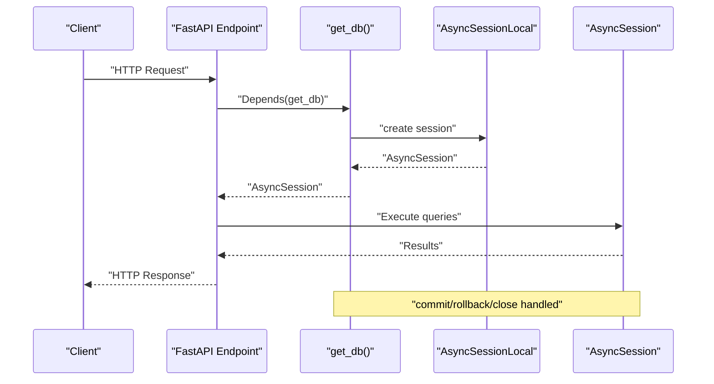
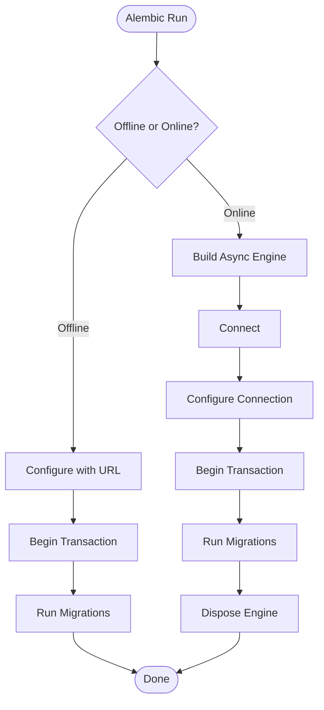
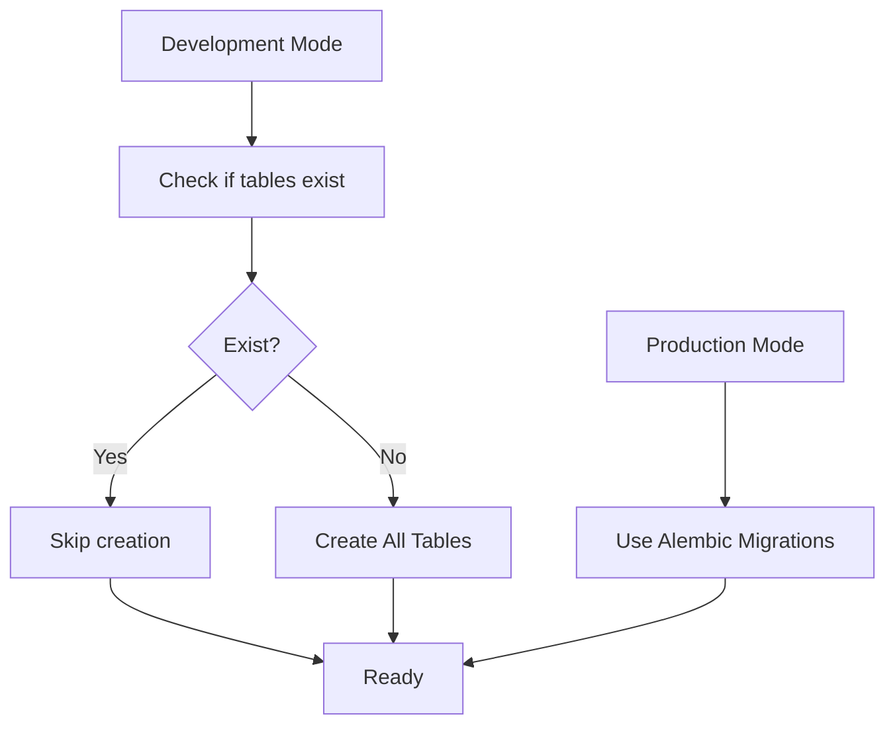
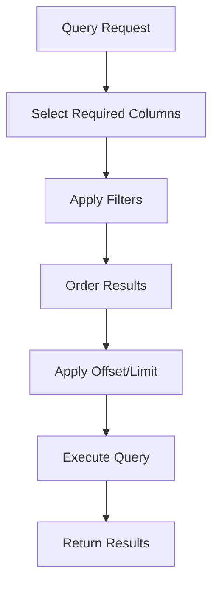
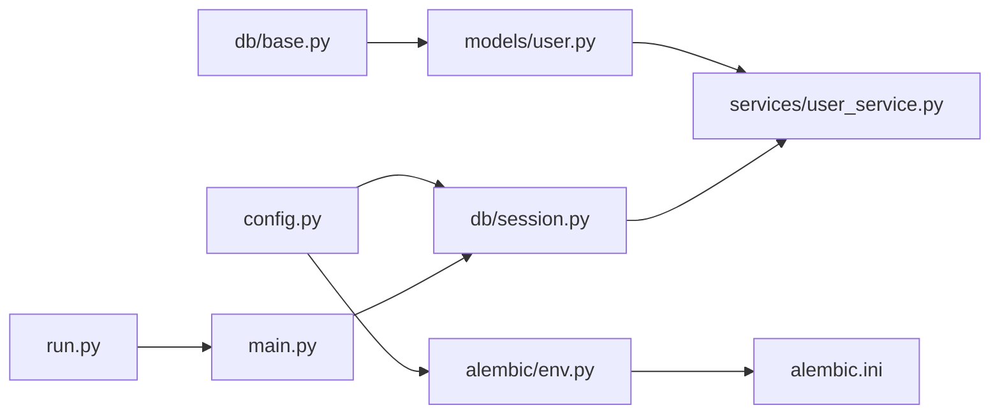

# Database Design

<cite>
**Referenced Files in This Document**
- [base.py](file://backend/app/db/base.py)
- [user.py](file://backend/app/models/user.py)
- [session.py](file://backend/app/db/session.py)
- [config.py](file://backend/app/core/config.py)
- [env.py](file://backend/alembic/env.py)
- [alembic.ini](file://backend/alembic.ini)
- [user.py](file://backend/app/schemas/user.py)
- [user_service.py](file://backend/app/services/user_service.py)
- [base_service.py](file://backend/app/services/base_service.py)
- [main.py](file://backend/app/main.py)
- [run.py](file://backend/run.py)
- [requirements.txt](file://backend/requirements.txt)
</cite>

## Table of Contents
1. [Introduction](#introduction)
2. [Project Structure](#project-structure)
3. [Core Components](#core-components)
4. [Architecture Overview](#architecture-overview)
5. [Detailed Component Analysis](#detailed-component-analysis)
6. [Dependency Analysis](#dependency-analysis)
7. [Performance Considerations](#performance-considerations)
8. [Troubleshooting Guide](#troubleshooting-guide)
9. [Conclusion](#conclusion)
10. [Appendices](#appendices)

## Introduction
This document provides comprehensive database design documentation for the backend. It covers the data model for the user entity, SQLAlchemy ORM configuration, session management, connection pooling, migration strategy with Alembic, and operational guidance for initialization, seeding, validation, indexing, query optimization, performance, security, backups, and disaster recovery.

## Project Structure
The database layer is organized around SQLAlchemy declarative models, async session management, and Alembic migrations. Key modules:
- Models define the user entity and share a common base for timestamps and naming.
- Session management provides async engine and dependency injection for FastAPI.
- Alembic handles offline and online migrations with async PostgreSQL support.
- Configuration centralizes database URLs and environment-driven behavior.
- Services encapsulate business logic and integrate with schemas and models.

**Diagram sources**
- [config.py:1-131](file://backend/app/core/config.py#L1-L131)
- [base.py:10-26](file://backend/app/db/base.py#L10-L26)
- [user.py:13-50](file://backend/app/models/user.py#L13-L50)
- [session.py:14-54](file://backend/app/db/session.py#L14-L54)
- [env.py:14-103](file://backend/alembic/env.py#L14-L103)
- [alembic.ini:1-106](file://backend/alembic.ini#L1-L106)
- [main.py:18-82](file://backend/app/main.py#L18-L82)
- [run.py:11-19](file://backend/run.py#L11-L19)
- [user_service.py:18-127](file://backend/app/services/user_service.py#L18-L127)
- [base_service.py:19-152](file://backend/app/services/base_service.py#L19-L152)
- [user.py:1-49](file://backend/app/schemas/user.py#L1-L49)

**Section sources**
- [base.py:10-26](file://backend/app/db/base.py#L10-L26)
- [user.py:13-50](file://backend/app/models/user.py#L13-L50)
- [session.py:14-54](file://backend/app/db/session.py#L14-L54)
- [config.py:73-91](file://backend/app/core/config.py#L73-L91)
- [env.py:14-36](file://backend/alembic/env.py#L14-L36)
- [alembic.ini:53](file://backend/alembic.ini#L53)
- [main.py:35-46](file://backend/app/main.py#L35-L46)
- [run.py:11-19](file://backend/run.py#L11-L19)
- [user_service.py:18-127](file://backend/app/services/user_service.py#L18-L127)
- [base_service.py:19-152](file://backend/app/services/base_service.py#L19-L152)
- [user.py:1-49](file://backend/app/schemas/user.py#L1-L49)

## Core Components
- User model: Defines identity, credentials, and verification flags with UUID primary key and indexed email.
- Base ORM: Provides automatic table naming and shared created_at/updated_at timestamps.
- Session management: Async engine and session factory with dependency injection and transaction lifecycle.
- Configuration: Centralized settings for async and sync database URLs, environment detection, and debug toggles.
- Alembic environment: Offline and online migration support with async engine and model metadata discovery.
- Services: Business logic for user operations, including password hashing, authentication, and CRUD via generic base service.

**Section sources**
- [user.py:13-50](file://backend/app/models/user.py#L13-L50)
- [base.py:10-26](file://backend/app/db/base.py#L10-L26)
- [session.py:14-54](file://backend/app/db/session.py#L14-L54)
- [config.py:73-91](file://backend/app/core/config.py#L73-L91)
- [env.py:14-36](file://backend/alembic/env.py#L14-L36)
- [user_service.py:18-127](file://backend/app/services/user_service.py#L18-L127)
- [base_service.py:19-152](file://backend/app/services/base_service.py#L19-L152)

## Architecture Overview
The database architecture integrates FastAPI with SQLAlchemy’s async ORM and Alembic migrations. The session dependency injects an AsyncSession per request, ensuring proper commit/rollback and closure. Alembic uses the sync URL for migrations while the app runs with async connections.

**Diagram sources**
- [main.py:18-82](file://backend/app/main.py#L18-L82)
- [session.py:14-54](file://backend/app/db/session.py#L14-L54)
- [user.py:13-50](file://backend/app/models/user.py#L13-L50)
- [base.py:10-26](file://backend/app/db/base.py#L10-L26)
- [config.py:73-91](file://backend/app/core/config.py#L73-L91)
- [env.py:14-36](file://backend/alembic/env.py#L14-L36)
- [alembic.ini:53](file://backend/alembic.ini#L53)

## Detailed Component Analysis

### User Data Model
- Identity: UUID primary key with default generation.
- Credentials: Email stored as unique and indexed; hashed password stored after bcrypt hashing.
- Status: Boolean flags for activity and verification with defaults.
- Metadata: Automatic timestamps for creation and updates.

**Diagram sources**
- [user.py:18-46](file://backend/app/models/user.py#L18-L46)
- [base.py:19-25](file://backend/app/db/base.py#L19-L25)

**Section sources**
- [user.py:13-50](file://backend/app/models/user.py#L13-L50)
- [base.py:10-26](file://backend/app/db/base.py#L10-L26)

### SQLAlchemy ORM Configuration and Base Class
- Automatic table naming derived from class names.
- Shared created_at and updated_at columns with server-side defaults and on-update triggers.

**Diagram sources**
- [base.py:10-26](file://backend/app/db/base.py#L10-L26)
- [user.py:13-50](file://backend/app/models/user.py#L13-L50)

**Section sources**
- [base.py:10-26](file://backend/app/db/base.py#L10-L26)
- [user.py:13-50](file://backend/app/models/user.py#L13-L50)

### Session Management and Dependency Injection
- Async engine configured with optional NullPool for testing.
- Async session factory with explicit configuration.
- Dependency function yields sessions per request, committing on success, rolling back on exceptions, and closing afterward.

**Diagram sources**
- [session.py:32-54](file://backend/app/db/session.py#L32-L54)

**Section sources**
- [session.py:14-54](file://backend/app/db/session.py#L14-L54)

### Migration Strategy with Alembic
- Alembic environment loads settings and registers models for metadata discovery.
- Supports offline and online modes; uses async engine for online migrations.
- Alembic configuration file defines script location and logging.

**Diagram sources**
- [env.py:44-102](file://backend/alembic/env.py#L44-L102)
- [alembic.ini:5-13](file://backend/alembic.ini#L5-L13)

**Section sources**
- [env.py:14-36](file://backend/alembic/env.py#L14-L36)
- [alembic.ini:53](file://backend/alembic.ini#L53)

### Database Initialization and Schema Validation
- Development: Application lifespan can optionally create tables using the async engine; production should use Alembic.
- Schema validation: Unique constraint on email enforced at the database level; Pydantic schemas enforce field constraints.

**Diagram sources**
- [main.py:35-40](file://backend/app/main.py#L35-L40)
- [user.py:10-18](file://backend/app/schemas/user.py#L10-L18)

**Section sources**
- [main.py:35-40](file://backend/app/main.py#L35-L40)
- [user.py:10-18](file://backend/app/schemas/user.py#L10-L18)

### Indexing Strategies and Query Optimization
- Index on email column to optimize lookups by email.
- Consider composite indexes for frequent filter combinations if usage grows.
- Use pagination in services to avoid large result sets.

**Diagram sources**
- [base_service.py:45-64](file://backend/app/services/base_service.py#L45-L64)
- [user_service.py:36-49](file://backend/app/services/user_service.py#L36-L49)

**Section sources**
- [user.py:27-32](file://backend/app/models/user.py#L27-L32)
- [base_service.py:45-64](file://backend/app/services/base_service.py#L45-L64)
- [user_service.py:36-49](file://backend/app/services/user_service.py#L36-L49)

### Security, Backup, and Disaster Recovery
- Password hashing: bcrypt via passlib; hashing occurs in the user service before persistence.
- Secrets and URLs: managed via environment variables and Pydantic settings.
- Backups: Schedule regular logical backups of the PostgreSQL database; test restore procedures periodically.
- DR: Maintain offsite backups, monitor replication lag, and define RTO/RPO targets aligned with business requirements.

**Section sources**
- [user_service.py:14-34](file://backend/app/services/user_service.py#L14-L34)
- [config.py:32-91](file://backend/app/core/config.py#L32-L91)

## Dependency Analysis
The following diagram shows key dependencies among modules involved in database operations and migrations.

**Diagram sources**
- [config.py:73-91](file://backend/app/core/config.py#L73-L91)
- [session.py:14-54](file://backend/app/db/session.py#L14-L54)
- [env.py:14-36](file://backend/alembic/env.py#L14-L36)
- [base.py:10-26](file://backend/app/db/base.py#L10-L26)
- [user.py:13-50](file://backend/app/models/user.py#L13-L50)
- [user_service.py:18-127](file://backend/app/services/user_service.py#L18-L127)
- [alembic.ini:53](file://backend/alembic.ini#L53)
- [main.py:18-82](file://backend/app/main.py#L18-L82)
- [run.py:11-19](file://backend/run.py#L11-L19)

**Section sources**
- [config.py:73-91](file://backend/app/core/config.py#L73-L91)
- [session.py:14-54](file://backend/app/db/session.py#L14-L54)
- [env.py:14-36](file://backend/alembic/env.py#L14-L36)
- [base.py:10-26](file://backend/app/db/base.py#L10-L26)
- [user.py:13-50](file://backend/app/models/user.py#L13-L50)
- [user_service.py:18-127](file://backend/app/services/user_service.py#L18-L127)
- [alembic.ini:53](file://backend/alembic.ini#L53)
- [main.py:18-82](file://backend/app/main.py#L18-L82)
- [run.py:11-19](file://backend/run.py#L11-L19)

## Performance Considerations
- Use async I/O for database operations to minimize blocking.
- Pooling: NullPool is used conditionally for testing; production should configure appropriate pool settings in the async engine.
- Queries: Prefer selective field retrieval, pagination, and indexes for high-cardinality filters.
- Logging: Enable SQL logging only in debug mode to avoid overhead.

**Section sources**
- [session.py:14-29](file://backend/app/db/session.py#L14-L29)
- [config.py:24](file://backend/app/core/config.py#L24)
- [base_service.py:45-64](file://backend/app/services/base_service.py#L45-L64)

## Troubleshooting Guide
- Connection failures: Verify DATABASE_URL or individual POSTGRES_* environment variables; confirm PostgreSQL availability.
- Migration errors: Ensure models are imported in Alembic env so metadata is discovered; run online/offline migrations accordingly.
- Session lifecycle: Confirm get_db dependency is used in endpoints; exceptions trigger rollback and session close.
- Health checks: Use the /health endpoint to validate runtime status.

**Section sources**
- [config.py:32-91](file://backend/app/core/config.py#L32-L91)
- [env.py:17-36](file://backend/alembic/env.py#L17-L36)
- [session.py:32-54](file://backend/app/db/session.py#L32-L54)
- [main.py:109-116](file://backend/app/main.py#L109-L116)

## Conclusion
The database design leverages SQLAlchemy’s async ORM, a clean separation of concerns via services and schemas, and Alembic migrations for robust schema evolution. The user model is optimized for identity and security, with clear indexing and validation. Operational practices such as environment-aware configuration, explicit session lifecycle management, and migration discipline support reliable deployments and maintenance.

## Appendices

### Appendix A: Environment Variables and URLs
- Async database URL: Generated from POSTGRES_* variables or overridden by DATABASE_URL.
- Sync database URL: Used by Alembic for migrations.
- Environment detection influences behavior such as table creation in development and SQL logging.

**Section sources**
- [config.py:32-91](file://backend/app/core/config.py#L32-L91)
- [main.py:35-40](file://backend/app/main.py#L35-L40)

### Appendix B: Requirements and Dependencies
- Core database stack includes SQLAlchemy asyncio, asyncpg, and Alembic.
- Security libraries include passlib for bcrypt hashing.

**Section sources**
- [requirements.txt:5-8](file://backend/requirements.txt#L5-L8)
- [requirements.txt:16-17](file://backend/requirements.txt#L16-L17)