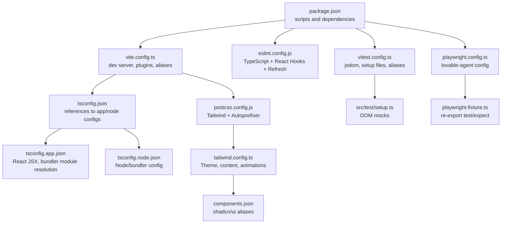
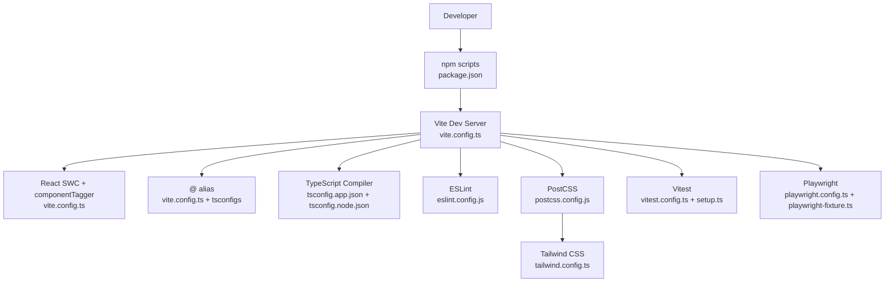
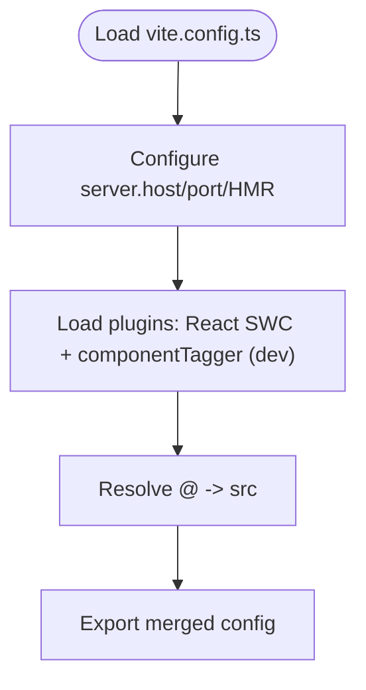
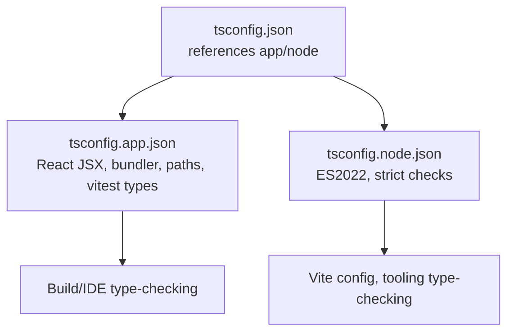
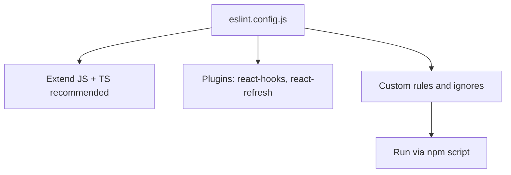
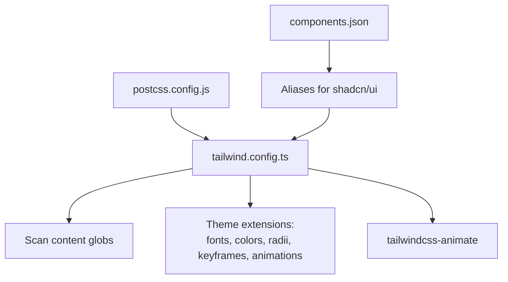
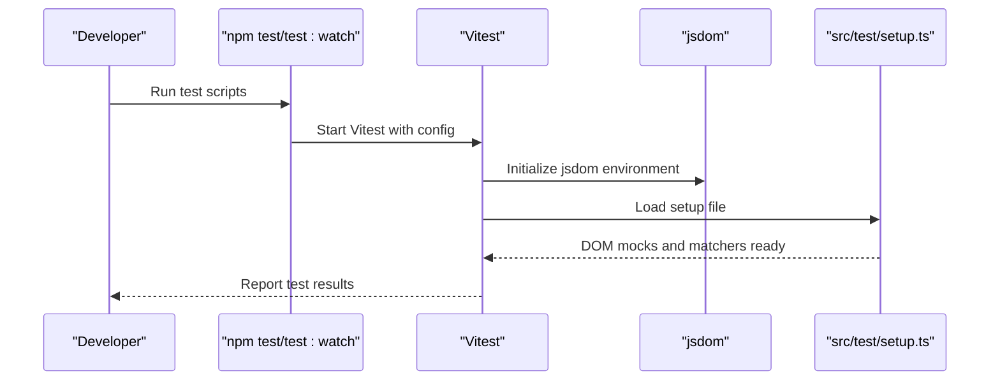
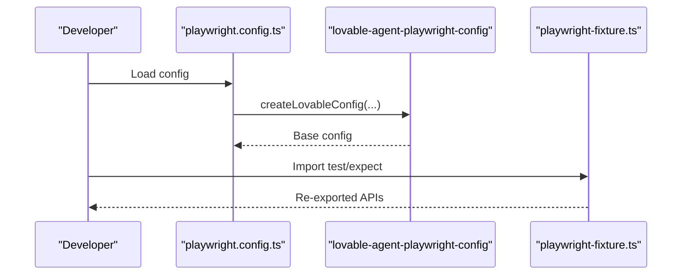
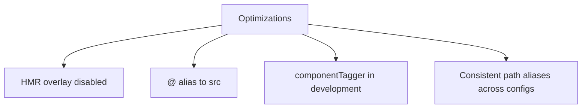
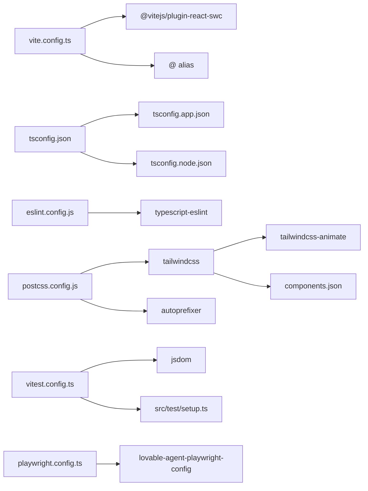

# Development Tools

<cite>
**Referenced Files in This Document**
- [package.json](file://package.json)
- [vite.config.ts](file://vite.config.ts)
- [tsconfig.json](file://tsconfig.json)
- [tsconfig.app.json](file://tsconfig.app.json)
- [tsconfig.node.json](file://tsconfig.node.json)
- [eslint.config.js](file://eslint.config.js)
- [postcss.config.js](file://postcss.config.js)
- [tailwind.config.ts](file://tailwind.config.ts)
- [components.json](file://components.json)
- [vitest.config.ts](file://vitest.config.ts)
- [src/test/setup.ts](file://src/test/setup.ts)
- [playwright.config.ts](file://playwright.config.ts)
- [playwright-fixture.ts](file://playwright-fixture.ts)
- [README.md](file://README.md)
</cite>

## Table of Contents
1. [Introduction](#introduction)
2. [Project Structure](#project-structure)
3. [Core Components](#core-components)
4. [Architecture Overview](#architecture-overview)
5. [Detailed Component Analysis](#detailed-component-analysis)
6. [Dependency Analysis](#dependency-analysis)
7. [Performance Considerations](#performance-considerations)
8. [Troubleshooting Guide](#troubleshooting-guide)
9. [Conclusion](#conclusion)
10. [Appendices](#appendices)

## Introduction
This document describes the development toolchain and build system for the frontend. It covers Vite configuration for fast development and optimized builds, TypeScript compilation settings, ESLint integration for code quality, testing with Vitest and Playwright, PostCSS and Tailwind CSS customization, development workflow optimization, debugging strategies, hot reload configuration, performance profiling, continuous integration considerations, code formatting standards, pre-commit hooks, and team collaboration workflows.

## Project Structure
The frontend toolchain is organized around Vite as the bundler and dev server, TypeScript for type safety, ESLint for linting, Vitest for unit testing, Playwright for E2E testing, and Tailwind CSS with PostCSS for styling. Key configuration files define behavior for development, builds, testing, and styling.

**Diagram sources**
- [package.json:1-91](file://package.json#L1-L91)
- [vite.config.ts:1-22](file://vite.config.ts#L1-L22)
- [tsconfig.json:1-24](file://tsconfig.json#L1-L24)
- [tsconfig.app.json:1-35](file://tsconfig.app.json#L1-L35)
- [tsconfig.node.json:1-23](file://tsconfig.node.json#L1-L23)
- [eslint.config.js:1-27](file://eslint.config.js#L1-L27)
- [postcss.config.js:1-7](file://postcss.config.js#L1-L7)
- [tailwind.config.ts:1-118](file://tailwind.config.ts#L1-L118)
- [components.json:1-21](file://components.json#L1-L21)
- [vitest.config.ts:1-17](file://vitest.config.ts#L1-L17)
- [src/test/setup.ts:1-16](file://src/test/setup.ts#L1-L16)
- [playwright.config.ts:1-11](file://playwright.config.ts#L1-L11)
- [playwright-fixture.ts:1-4](file://playwright-fixture.ts#L1-L4)

**Section sources**
- [package.json:1-91](file://package.json#L1-L91)
- [README.md:1-74](file://README.md#L1-L74)

## Core Components
- Vite dev server and build tool with React SWC plugin and path aliasing.
- TypeScript configurations for app and node environments.
- ESLint with TypeScript and React-specific plugins.
- PostCSS pipeline with Tailwind CSS and Autoprefixer.
- Tailwind configuration with custom theme, animations, and content scanning.
- Vitest for unit testing with jsdom environment and setup hooks.
- Playwright for E2E testing using a shared configuration package.
- shadcn/ui integration via components.json aliases.

**Section sources**
- [vite.config.ts:1-22](file://vite.config.ts#L1-L22)
- [tsconfig.json:1-24](file://tsconfig.json#L1-L24)
- [tsconfig.app.json:1-35](file://tsconfig.app.json#L1-L35)
- [tsconfig.node.json:1-23](file://tsconfig.node.json#L1-L23)
- [eslint.config.js:1-27](file://eslint.config.js#L1-L27)
- [postcss.config.js:1-7](file://postcss.config.js#L1-L7)
- [tailwind.config.ts:1-118](file://tailwind.config.ts#L1-L118)
- [components.json:1-21](file://components.json#L1-L21)
- [vitest.config.ts:1-17](file://vitest.config.ts#L1-L17)
- [src/test/setup.ts:1-16](file://src/test/setup.ts#L1-L16)
- [playwright.config.ts:1-11](file://playwright.config.ts#L1-L11)
- [playwright-fixture.ts:1-4](file://playwright-fixture.ts#L1-L4)

## Architecture Overview
The toolchain integrates the following flows:
- Development server: Vite loads plugins, resolves aliases, and serves with hot reload.
- Build process: Vite bundles assets and code for production.
- Type checking and linting: TypeScript compiles per environment configs; ESLint enforces style and React rules.
- Styling pipeline: PostCSS runs Tailwind and Autoprefixer against scanned content.
- Testing: Vitest runs unit tests in jsdom; Playwright runs E2E tests with shared configuration.

**Diagram sources**
- [package.json:6-14](file://package.json#L6-L14)
- [vite.config.ts:7-21](file://vite.config.ts#L7-L21)
- [tsconfig.app.json:19-31](file://tsconfig.app.json#L19-L31)
- [tsconfig.node.json:8-21](file://tsconfig.node.json#L8-L21)
- [eslint.config.js:7-26](file://eslint.config.js#L7-L26)
- [postcss.config.js:1-7](file://postcss.config.js#L1-L7)
- [tailwind.config.ts:3-117](file://tailwind.config.ts#L3-L117)
- [vitest.config.ts:5-16](file://vitest.config.ts#L5-L16)
- [src/test/setup.ts:1-16](file://src/test/setup.ts#L1-L16)
- [playwright.config.ts:1-11](file://playwright.config.ts#L1-L11)
- [playwright-fixture.ts:1-4](file://playwright-fixture.ts#L1-L4)

## Detailed Component Analysis

### Vite Configuration
- Dev server: Host binding, port, and HMR overlay disabled for cleaner feedback.
- Plugins: React SWC for fast JSX transformation; componentTagger enabled in development.
- Aliasing: @ resolves to src for concise imports.
- Environment: Uses mode-aware configuration for development vs. production.

**Diagram sources**
- [vite.config.ts:7-21](file://vite.config.ts#L7-L21)

**Section sources**
- [vite.config.ts:1-22](file://vite.config.ts#L1-L22)

### TypeScript Compilation Settings
- Root tsconfig references app and node configs.
- App config:
  - JSX runtime: react-jsx
  - Module resolution: bundler
  - Paths: @/*
  - Types include Vitest globals
- Node config:
  - Targets ES2022
  - Strictness focused on unused locals/params and switch exhaustiveness

**Diagram sources**
- [tsconfig.json:16-23](file://tsconfig.json#L16-L23)
- [tsconfig.app.json:19-31](file://tsconfig.app.json#L19-L31)
- [tsconfig.node.json:2-21](file://tsconfig.node.json#L2-L21)

**Section sources**
- [tsconfig.json:1-24](file://tsconfig.json#L1-L24)
- [tsconfig.app.json:1-35](file://tsconfig.app.json#L1-L35)
- [tsconfig.node.json:1-23](file://tsconfig.node.json#L1-L23)

### ESLint Integration
- Uses flat config with TypeScript and React plugins.
- Extends recommended rulesets for JS and TS.
- Enables React Hooks and React Refresh rules.
- Disables unused vars rule globally.
- Ignores dist folder.

**Diagram sources**
- [eslint.config.js:7-26](file://eslint.config.js#L7-L26)

**Section sources**
- [eslint.config.js:1-27](file://eslint.config.js#L1-L27)
- [package.json:10](file://package.json#L10)

### PostCSS and Tailwind CSS
- PostCSS pipeline: Tailwind CSS and Autoprefixer.
- Tailwind config:
  - Content globs for pages/components/app/src
  - Dark mode strategy: class
  - Custom fonts, colors, radii, keyframes, and animations
  - Plugin: tailwindcss-animate
- shadcn/ui integration via components.json with aliases for components, utils, ui, lib, hooks.

**Diagram sources**
- [postcss.config.js:1-7](file://postcss.config.js#L1-L7)
- [tailwind.config.ts:3-117](file://tailwind.config.ts#L3-L117)
- [components.json:6-20](file://components.json#L6-L20)

**Section sources**
- [postcss.config.js:1-7](file://postcss.config.js#L1-L7)
- [tailwind.config.ts:1-118](file://tailwind.config.ts#L1-L118)
- [components.json:1-21](file://components.json#L1-L21)

### Testing Setup

#### Vitest (Unit Tests)
- Environment: jsdom
- Globals enabled
- Setup file initializes DOM mocks and jest-dom matchers
- Includes test files under src with .test/.spec.{ts,tsx}
- Aliasing configured to @ for imports

**Diagram sources**
- [package.json:12-13](file://package.json#L12-L13)
- [vitest.config.ts:5-16](file://vitest.config.ts#L5-L16)
- [src/test/setup.ts:1-16](file://src/test/setup.ts#L1-L16)

**Section sources**
- [vitest.config.ts:1-17](file://vitest.config.ts#L1-L17)
- [src/test/setup.ts:1-16](file://src/test/setup.ts#L1-L16)
- [package.json:12-13](file://package.json#L12-L13)

#### Playwright (End-to-End Tests)
- Uses a shared configuration package to create a base config.
- Provides a fixture file to re-export test and expect for convenience.

**Diagram sources**
- [playwright.config.ts:1-11](file://playwright.config.ts#L1-L11)
- [playwright-fixture.ts:1-4](file://playwright-fixture.ts#L1-L4)

**Section sources**
- [playwright.config.ts:1-11](file://playwright.config.ts#L1-L11)
- [playwright-fixture.ts:1-4](file://playwright-fixture.ts#L1-L4)

### Development Workflow Optimization
- Hot reload: Enabled via Vite HMR; overlay disabled for less noise.
- Aliasing: @ resolves to src for shorter imports.
- Component tagging: Optional componentTagger plugin active in development.
- Path aliases: Consistent across Vite, Vitest, and TypeScript configs.

**Diagram sources**
- [vite.config.ts:8-21](file://vite.config.ts#L8-L21)
- [tsconfig.app.json:19-23](file://tsconfig.app.json#L19-L23)
- [vitest.config.ts:13-15](file://vitest.config.ts#L13-L15)

**Section sources**
- [vite.config.ts:1-22](file://vite.config.ts#L1-L22)
- [tsconfig.app.json:19-23](file://tsconfig.app.json#L19-L23)
- [vitest.config.ts:13-15](file://vitest.config.ts#L13-L15)

### Debugging Strategies
- HMR overlay disabled to reduce visual noise during debugging.
- jsdom environment in Vitest provides DOM APIs for component tests.
- Setup file defines window.matchMedia to avoid SSR-related test failures.
- Jest-dom matchers enable semantic assertions in unit tests.

**Section sources**
- [vite.config.ts:11-13](file://vite.config.ts#L11-L13)
- [src/test/setup.ts:1-16](file://src/test/setup.ts#L1-L16)
- [vitest.config.ts:8](file://vitest.config.ts#L8)

### Continuous Integration and Pre-commit Hooks
- CI setup: No explicit CI configuration found in the repository snapshot.
- Pre-commit hooks: Not present in the repository snapshot.
- Recommendation: Integrate ESLint and Vitest in CI jobs; consider adding Husky or similar for pre-commit hooks to enforce formatting and tests.

[No sources needed since this section provides general guidance]

### Code Formatting Standards
- ESLint handles formatting rules via TypeScript ESLint and plugin configurations.
- No separate formatter (e.g., Prettier) explicitly configured in the repository snapshot.
- Recommendation: Add a formatter and integrate it with ESLint and pre-commit hooks.

**Section sources**
- [eslint.config.js:1-27](file://eslint.config.js#L1-L27)

## Dependency Analysis
The toolchain components depend on each other as follows:
- Vite depends on React SWC plugin and path aliases.
- TypeScript configs depend on each other and on Vite for type-checking.
- ESLint depends on TypeScript and React plugins.
- PostCSS depends on Tailwind and Autoprefixer.
- Tailwind depends on components.json for shadcn/ui aliases.
- Vitest depends on jsdom and setup file.
- Playwright depends on the shared configuration package.

**Diagram sources**
- [vite.config.ts:1-22](file://vite.config.ts#L1-L22)
- [tsconfig.json:16-23](file://tsconfig.json#L16-L23)
- [tsconfig.app.json:19-31](file://tsconfig.app.json#L19-L31)
- [tsconfig.node.json:8-21](file://tsconfig.node.json#L8-L21)
- [eslint.config.js:1-27](file://eslint.config.js#L1-L27)
- [postcss.config.js:1-7](file://postcss.config.js#L1-L7)
- [tailwind.config.ts:116](file://tailwind.config.ts#L116)
- [components.json:6-20](file://components.json#L6-L20)
- [vitest.config.ts:5-16](file://vitest.config.ts#L5-L16)
- [src/test/setup.ts:1-16](file://src/test/setup.ts#L1-L16)
- [playwright.config.ts:1-11](file://playwright.config.ts#L1-L11)

**Section sources**
- [package.json:15-89](file://package.json#L15-L89)

## Performance Considerations
- Use Vite’s built-in HMR and fast React SWC plugin for rapid iteration.
- Keep TypeScript strictness balanced to avoid unnecessary overhead while maintaining safety.
- Tailwind’s content scanning should target only necessary paths to minimize rebuilds.
- Prefer jsdom for unit tests to avoid heavy browser initialization; use Playwright selectively for E2E scenarios.

[No sources needed since this section provides general guidance]

## Troubleshooting Guide
- HMR overlay: Disabled to reduce noise; if needed, enable overlay temporarily for visibility.
- Missing DOM APIs in tests: Ensure setup file is loaded and matchers are available.
- Path resolution: Confirm @ alias is defined consistently across Vite, Vitest, and TypeScript configs.
- Tailwind not generating styles: Verify content globs and ensure Tailwind scans the correct directories.

**Section sources**
- [vite.config.ts:11-13](file://vite.config.ts#L11-L13)
- [src/test/setup.ts:1-16](file://src/test/setup.ts#L1-L16)
- [tsconfig.app.json:19-23](file://tsconfig.app.json#L19-L23)
- [vitest.config.ts:13-15](file://vitest.config.ts#L13-L15)
- [tailwind.config.ts:5](file://tailwind.config.ts#L5)

## Conclusion
The project’s frontend toolchain leverages Vite for a fast dev/build experience, TypeScript for type safety, ESLint for code quality, Tailwind CSS for styling, and Vitest/Playwright for testing. The configuration emphasizes developer productivity through HMR, path aliases, and environment-specific setups. For CI and collaboration, consider integrating automated linting and testing, and establishing pre-commit hooks and shared formatting standards.

[No sources needed since this section summarizes without analyzing specific files]

## Appendices

### Quick Commands
- Start dev server: [package.json:7](file://package.json#L7)
- Build for production: [package.json:8](file://package.json#L8)
- Build for development: [package.json:9](file://package.json#L9)
- Preview build: [package.json:11](file://package.json#L11)
- Lint code: [package.json:10](file://package.json#L10)
- Run unit tests: [package.json:12](file://package.json#L12)
- Run unit tests in watch mode: [package.json:13](file://package.json#L13)

**Section sources**
- [package.json:6-14](file://package.json#L6-L14)

### Getting Started
- Follow the steps in the repository’s README to set up the environment and start the dev server.

**Section sources**
- [README.md:23-37](file://README.md#L23-L37)