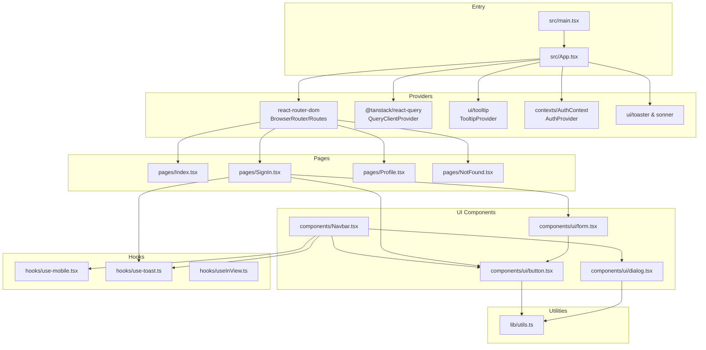
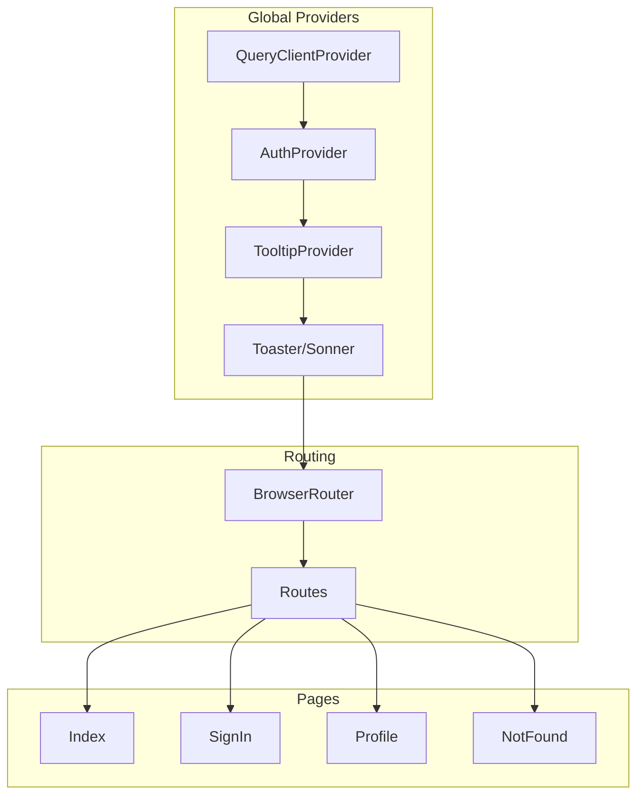
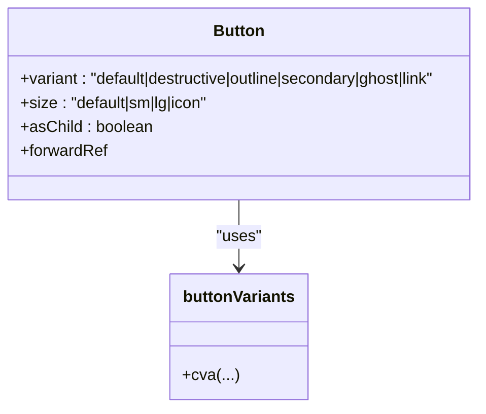
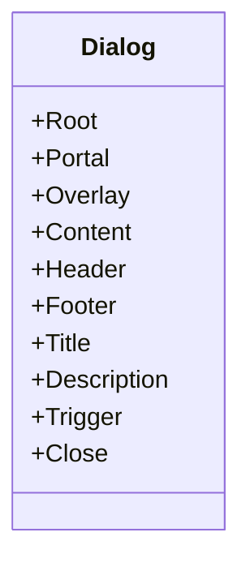
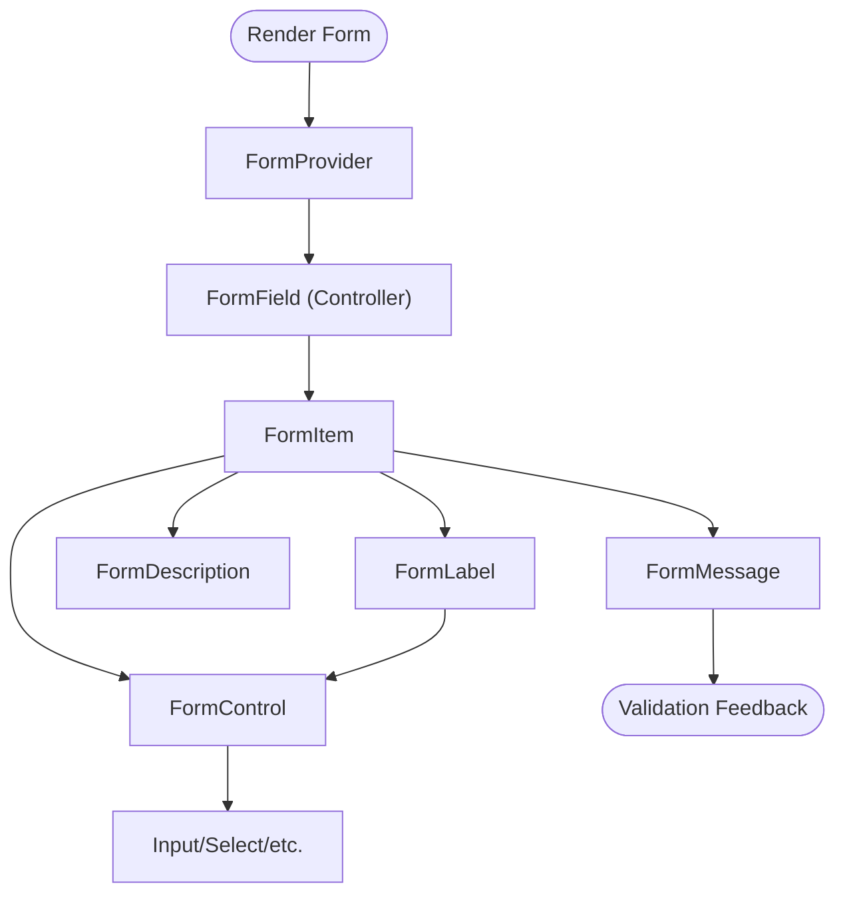
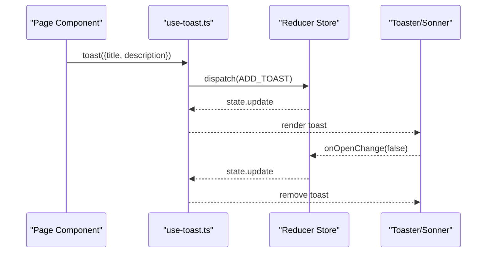
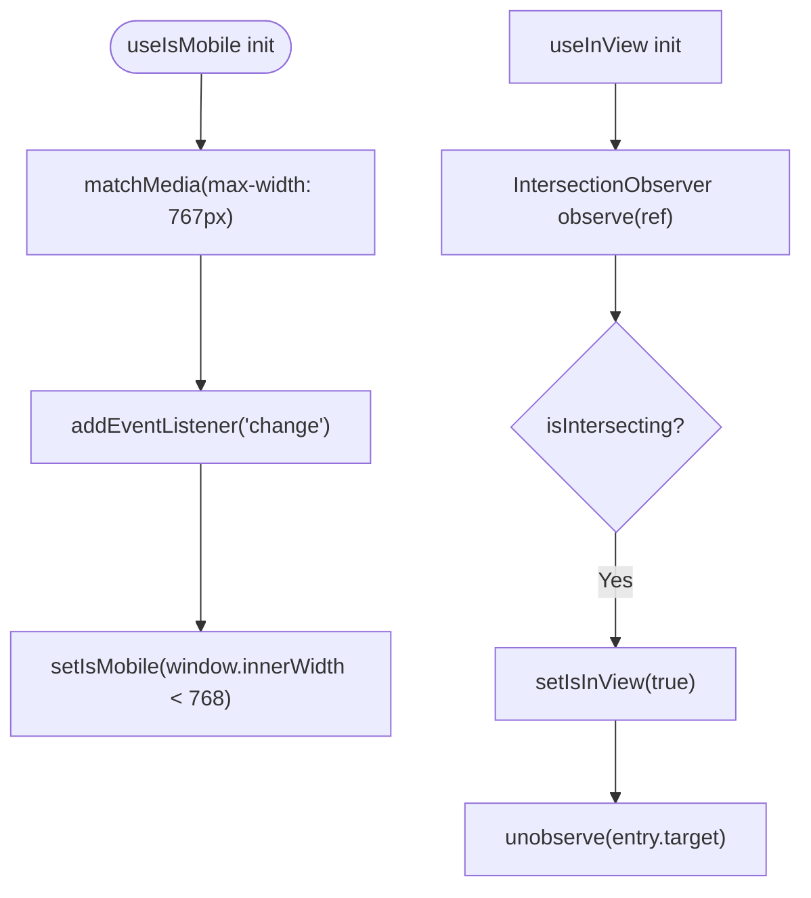
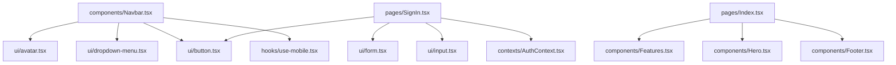
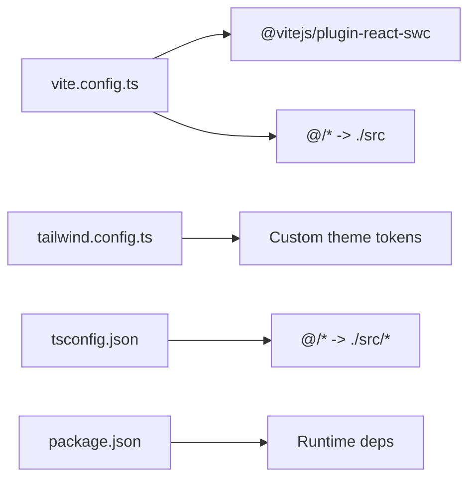

# Frontend Architecture

<cite>
**Referenced Files in This Document**
- [main.tsx](file://src/main.tsx)
- [App.tsx](file://src/App.tsx)
- [package.json](file://package.json)
- [vite.config.ts](file://vite.config.ts)
- [tailwind.config.ts](file://tailwind.config.ts)
- [tsconfig.json](file://tsconfig.json)
- [AuthContext.tsx](file://src/contexts/AuthContext.tsx)
- [button.tsx](file://src/components/ui/button.tsx)
- [dialog.tsx](file://src/components/ui/dialog.tsx)
- [form.tsx](file://src/components/ui/form.tsx)
- [use-toast.ts](file://src/hooks/use-toast.ts)
- [use-mobile.tsx](file://src/hooks/use-mobile.tsx)
- [useInView.ts](file://src/hooks/useInView.ts)
- [utils.ts](file://src/lib/utils.ts)
- [Index.tsx](file://src/pages/Index.tsx)
- [SignIn.tsx](file://src/pages/SignIn.tsx)
- [Navbar.tsx](file://src/components/Navbar.tsx)
</cite>

## Table of Contents
1. [Introduction](#introduction)
2. [Project Structure](#project-structure)
3. [Core Components](#core-components)
4. [Architecture Overview](#architecture-overview)
5. [Detailed Component Analysis](#detailed-component-analysis)
6. [Dependency Analysis](#dependency-analysis)
7. [Performance Considerations](#performance-considerations)
8. [Troubleshooting Guide](#troubleshooting-guide)
9. [Conclusion](#conclusion)

## Introduction
This document describes the frontend architecture of the React application. It covers the component-based structure, file organization, design system integration with shadcn/ui and Tailwind CSS, application entry point, routing configuration, state management with React Context, reusable UI patterns, styling approach, build system with Vite and TypeScript, and development workflow. It also addresses performance considerations, code splitting strategies, and bundle optimization.

## Project Structure
The project follows a feature-driven and layer-based organization:
- Entry point initializes the React root and global styles.
- App wraps the application with providers for routing, authentication, tooltips, notifications, and React Query.
- Pages represent route-level components.
- Components are grouped under ui (design system primitives) and feature-specific components.
- Hooks encapsulate cross-cutting concerns like mobile detection, in-view animations, and toast notifications.
- Utilities centralize class merging and shared helpers.
- Configuration files define Vite, Tailwind CSS, and TypeScript settings.

**Diagram sources**
- [main.tsx:1-6](file://src/main.tsx#L1-L6)
- [App.tsx:1-34](file://src/App.tsx#L1-L34)
- [button.tsx:1-48](file://src/components/ui/button.tsx#L1-L48)
- [dialog.tsx:1-96](file://src/components/ui/dialog.tsx#L1-L96)
- [form.tsx:1-130](file://src/components/ui/form.tsx#L1-L130)
- [use-mobile.tsx:1-20](file://src/hooks/use-mobile.tsx#L1-L20)
- [use-toast.ts:1-187](file://src/hooks/use-toast.ts#L1-L187)
- [useInView.ts:1-25](file://src/hooks/useInView.ts#L1-L25)
- [utils.ts:1-7](file://src/lib/utils.ts#L1-L7)
- [Index.tsx:1-30](file://src/pages/Index.tsx#L1-L30)
- [SignIn.tsx:1-135](file://src/pages/SignIn.tsx#L1-L135)
- [Navbar.tsx:1-137](file://src/components/Navbar.tsx#L1-L137)

**Section sources**
- [main.tsx:1-6](file://src/main.tsx#L1-L6)
- [App.tsx:1-34](file://src/App.tsx#L1-L34)
- [package.json:1-91](file://package.json#L1-L91)
- [vite.config.ts:1-22](file://vite.config.ts#L1-L22)
- [tailwind.config.ts:1-118](file://tailwind.config.ts#L1-L118)
- [tsconfig.json:1-24](file://tsconfig.json#L1-L24)

## Core Components
- Application entry point: Initializes the root and mounts the App component.
- Root App: Wraps routes, providers, and global UI enhancements.
- Routing: Uses React Router DOM with a simple route tree.
- State Management: Authentication state via React Context persisted in localStorage.
- Design System: Shadcn/ui primitives built with Radix UI and styled with Tailwind CSS.
- Styling Utilities: clsx and tailwind-merge for composing conditional classes.
- Notifications: Toast system with a reducer-based store and imperative API.
- Responsive Utilities: Mobile detection hook and intersection observer hook for animations.

**Section sources**
- [main.tsx:1-6](file://src/main.tsx#L1-L6)
- [App.tsx:1-34](file://src/App.tsx#L1-L34)
- [AuthContext.tsx:1-48](file://src/contexts/AuthContext.tsx#L1-L48)
- [button.tsx:1-48](file://src/components/ui/button.tsx#L1-L48)
- [utils.ts:1-7](file://src/lib/utils.ts#L1-L7)
- [use-toast.ts:1-187](file://src/hooks/use-toast.ts#L1-L187)
- [use-mobile.tsx:1-20](file://src/hooks/use-mobile.tsx#L1-L20)
- [useInView.ts:1-25](file://src/hooks/useInView.ts#L1-L25)

## Architecture Overview
The application uses a layered provider pattern:
- Top-level providers manage global concerns: routing, authentication, tooltips, notifications, and data fetching.
- Feature pages compose domain components.
- UI primitives are thin wrappers around Radix UI with Tailwind styling and variant composition.

**Diagram sources**
- [App.tsx:1-34](file://src/App.tsx#L1-L34)

## Detailed Component Analysis

### Authentication Context
- Purpose: Centralized user state and actions with persistence.
- Pattern: Provider with derived computed values and imperative methods.
- Persistence: localStorage-backed hydration and updates.

```mermaid
classDiagram
class AuthContext {
+User user
+boolean isAuthenticated
+signIn(user) void
+signOut() void
}
class AuthProvider {
+useState(user)
+signIn(user) void
+signOut() void
}
class useAuth {
+returns AuthContextType
}
AuthProvider --> AuthContext : "provides"
useAuth --> AuthContext : "consumes"
```

**Diagram sources**
- [AuthContext.tsx:1-48](file://src/contexts/AuthContext.tsx#L1-L48)

**Section sources**
- [AuthContext.tsx:1-48](file://src/contexts/AuthContext.tsx#L1-L48)

### Button Primitive (Shadcn/ui)
- Purpose: Variants and sizes with consistent spacing and focus styles.
- Pattern: cva for variants, Slot for polymorphic rendering, cn for class merging.
- Integration: Used across SignIn and Navbar.

**Diagram sources**
- [button.tsx:1-48](file://src/components/ui/button.tsx#L1-L48)
- [utils.ts:1-7](file://src/lib/utils.ts#L1-L7)

**Section sources**
- [button.tsx:1-48](file://src/components/ui/button.tsx#L1-L48)
- [utils.ts:1-7](file://src/lib/utils.ts#L1-L7)

### Dialog Primitive (Shadcn/ui)
- Purpose: Modal overlay with portal rendering, animations, and close controls.
- Pattern: Composed components (Root, Portal, Overlay, Content, Header/Footer, Title, Description).
- Integration: Base for modals and dialogs across the app.

**Diagram sources**
- [dialog.tsx:1-96](file://src/components/ui/dialog.tsx#L1-L96)

**Section sources**
- [dialog.tsx:1-96](file://src/components/ui/dialog.tsx#L1-L96)

### Form Composition (Shadcn/ui + react-hook-form)
- Purpose: Structured form handling with labels, controls, descriptions, and messages.
- Pattern: Context-based field scoping, controlled rendering, and accessibility attributes.
- Integration: Used in SignIn form.

**Diagram sources**
- [form.tsx:1-130](file://src/components/ui/form.tsx#L1-L130)

**Section sources**
- [form.tsx:1-130](file://src/components/ui/form.tsx#L1-L130)

### Toast System
- Purpose: Imperative notifications with queue limits and auto-dismiss.
- Pattern: Reducer-based store, singleton memory state, and event listeners.
- Integration: Exposed via hooks and re-exported for convenience.

**Diagram sources**
- [use-toast.ts:1-187](file://src/hooks/use-toast.ts#L1-L187)
- [App.tsx:3-5](file://src/App.tsx#L3-L5)

**Section sources**
- [use-toast.ts:1-187](file://src/hooks/use-toast.ts#L1-L187)

### Responsive and Animation Utilities
- Mobile Detection: Media query-based hook returning a boolean state.
- In-View Observer: IntersectionObserver wrapper with configurable thresholds.

**Diagram sources**
- [use-mobile.tsx:1-20](file://src/hooks/use-mobile.tsx#L1-L20)
- [useInView.ts:1-25](file://src/hooks/useInView.ts#L1-L25)

**Section sources**
- [use-mobile.tsx:1-20](file://src/hooks/use-mobile.tsx#L1-L20)
- [useInView.ts:1-25](file://src/hooks/useInView.ts#L1-L25)

### Component Hierarchy and Reusable Patterns
- Navbar composes UI primitives (Avatar, DropdownMenu), integrates AuthContext, and uses responsive utilities.
- SignIn composes Button, Input, and Form components, and uses react-hook-form for validation.
- Index page composes feature components and applies background tokens.

**Diagram sources**
- [Navbar.tsx:1-137](file://src/components/Navbar.tsx#L1-L137)
- [SignIn.tsx:1-135](file://src/pages/SignIn.tsx#L1-L135)
- [Index.tsx:1-30](file://src/pages/Index.tsx#L1-L30)
- [AuthContext.tsx:1-48](file://src/contexts/AuthContext.tsx#L1-L48)

**Section sources**
- [Navbar.tsx:1-137](file://src/components/Navbar.tsx#L1-L137)
- [SignIn.tsx:1-135](file://src/pages/SignIn.tsx#L1-L135)
- [Index.tsx:1-30](file://src/pages/Index.tsx#L1-L30)

## Dependency Analysis
- Build and Tooling: Vite with React SWC plugin, path aliases, and optional component tagging in development.
- Styling: Tailwind CSS with custom theme tokens, animations, and content scanning across src.
- TypeScript: Path aliases configured and strict null checks relaxed for JS compatibility.
- Runtime Dependencies: React, React Router DOM, TanStack React Query, Radix UI primitives, shadcn/ui components, Tailwind utilities, and UI libraries.

**Diagram sources**
- [vite.config.ts:1-22](file://vite.config.ts#L1-L22)
- [tailwind.config.ts:1-118](file://tailwind.config.ts#L1-L118)
- [tsconfig.json:1-24](file://tsconfig.json#L1-L24)
- [package.json:1-91](file://package.json#L1-L91)

**Section sources**
- [vite.config.ts:1-22](file://vite.config.ts#L1-L22)
- [tailwind.config.ts:1-118](file://tailwind.config.ts#L1-L118)
- [tsconfig.json:1-24](file://tsconfig.json#L1-L24)
- [package.json:1-91](file://package.json#L1-L91)

## Performance Considerations
- Bundle Size and Tree Shaking: Prefer component-level imports from shadcn/ui and avoid importing entire libraries. Keep Radix UI primitives scoped to their usage.
- Code Splitting: Use dynamic imports for heavy pages or modals to defer loading until needed. For example, wrap heavy dialogs in dynamic imports to reduce initial bundle size.
- Rendering Optimizations: Memoize expensive computations and avoid unnecessary re-renders in frequently updated components. Use shallow comparisons where appropriate.
- Styling Efficiency: Leverage Tailwind’s JIT scanning and purge settings to minimize CSS. Avoid generating unused variants and utilities.
- Network and Caching: TanStack Query cache policies should be tuned per route/page to balance freshness and performance. Configure stale times and background refetch intervals thoughtfully.
- Dev Experience: Vite’s fast HMR and SWC-based transforms improve iteration speed. Use component tagging in development to track component usage.

[No sources needed since this section provides general guidance]

## Troubleshooting Guide
- Provider Order Issues: Ensure AuthProvider is above consumers like Navbar and SignIn. Verify TooltipProvider wraps interactive components.
- Missing Aliases: Confirm @ alias resolves to src and tsconfig paths match Vite resolve.alias.
- Tailwind Classes Not Applied: Check content globs in Tailwind config and ensure class names are not purged.
- Toast Limit Behavior: The toast system enforces a limit; if notifications disappear unexpectedly, confirm the limit and dismissal logic.
- Responsive Hook: useIsMobile relies on media queries; ensure breakpoints align with Tailwind’s configuration.

**Section sources**
- [App.tsx:1-34](file://src/App.tsx#L1-L34)
- [vite.config.ts:16-20](file://vite.config.ts#L16-L20)
- [tsconfig.json:7-11](file://tsconfig.json#L7-L11)
- [tailwind.config.ts:4-5](file://tailwind.config.ts#L4-L5)
- [use-toast.ts:5-6](file://src/hooks/use-toast.ts#L5-L6)

## Conclusion
The frontend employs a clean, provider-centric architecture with a strong design system foundation. The combination of shadcn/ui primitives, Radix UI, and Tailwind CSS yields a consistent, accessible, and maintainable UI. Vite and TypeScript streamline development and build performance. By leveraging React Context for authentication, TanStack Query for data, and thoughtful code splitting, the system balances developer productivity with runtime efficiency.