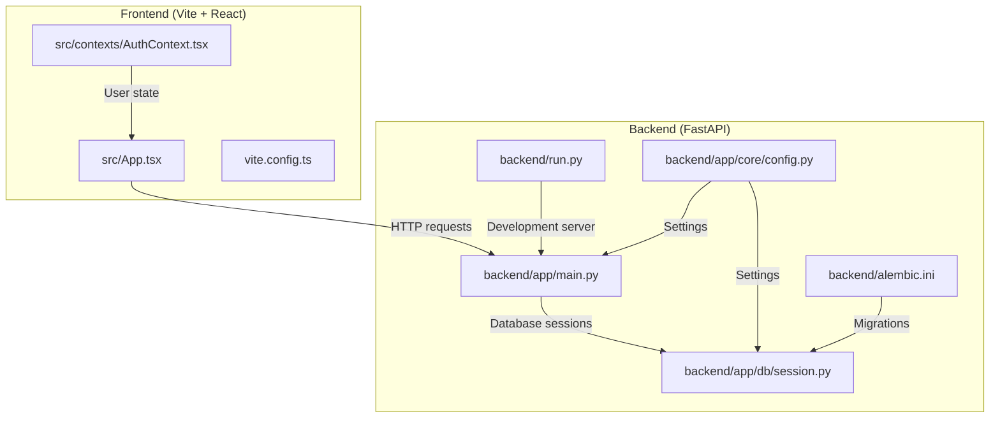
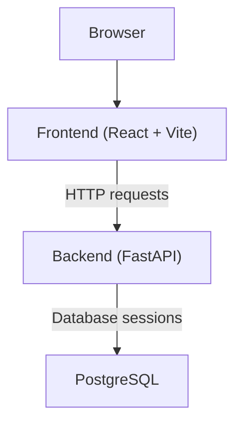
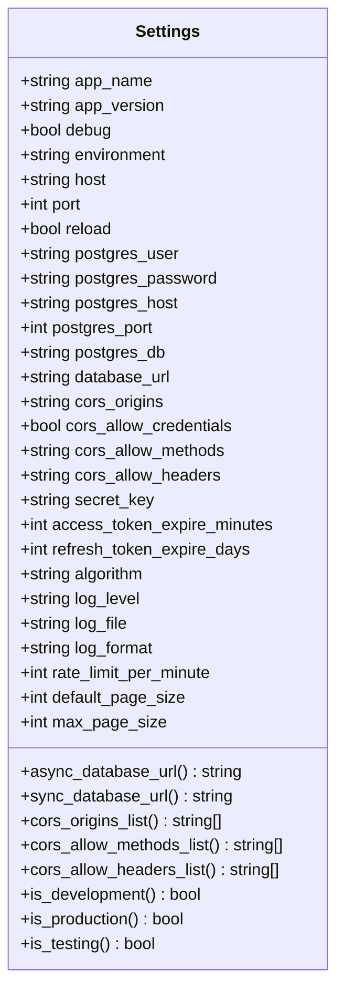
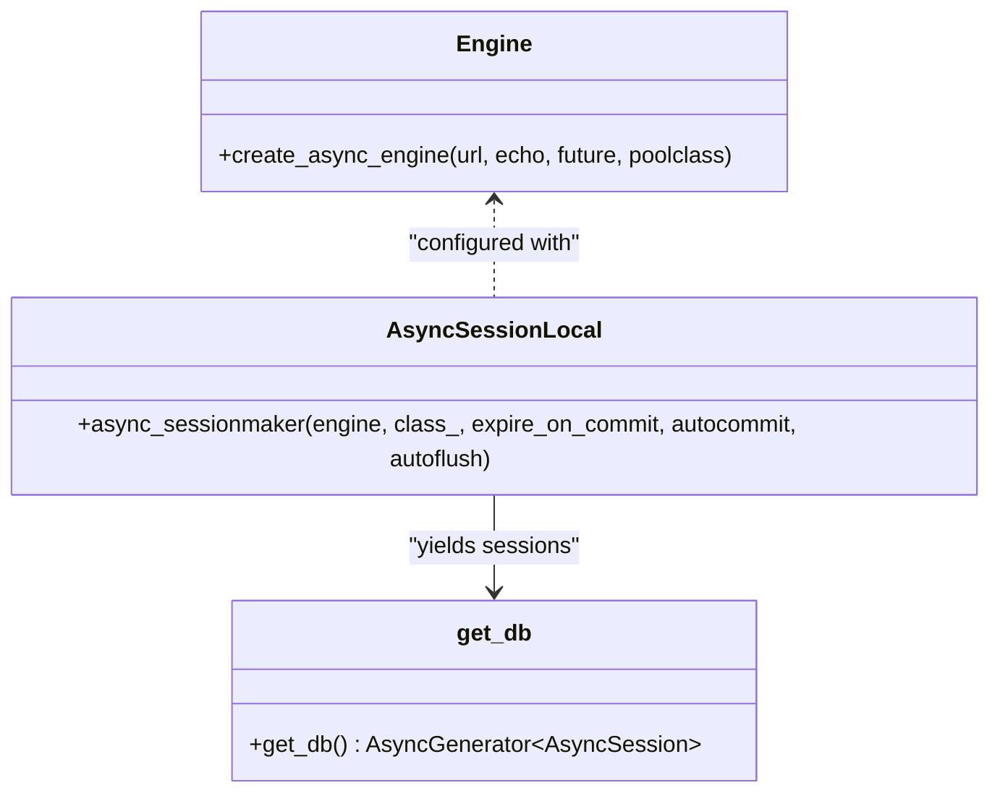
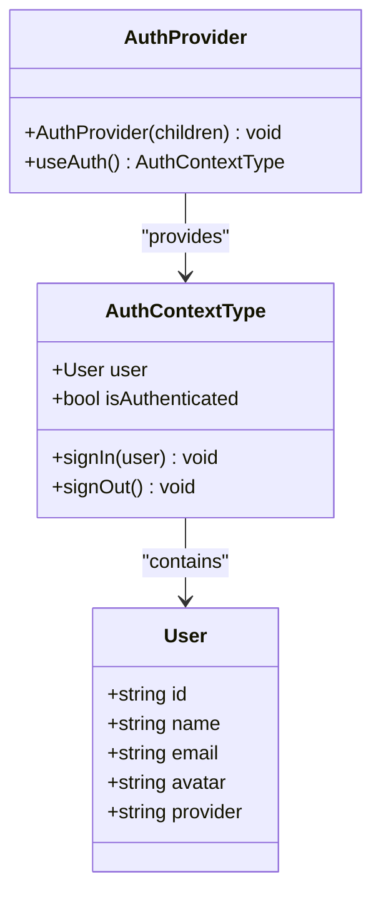
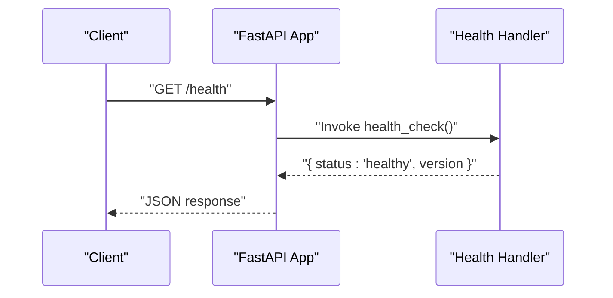
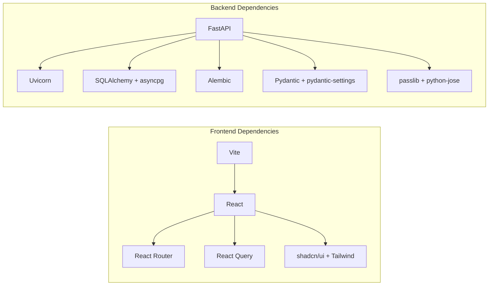

# Getting Started

<cite>
**Referenced Files in This Document**
- [README.md](file://README.md)
- [package.json](file://package.json)
- [vite.config.ts](file://vite.config.ts)
- [src/App.tsx](file://src/App.tsx)
- [src/contexts/AuthContext.tsx](file://src/contexts/AuthContext.tsx)
- [backend/requirements.txt](file://backend/requirements.txt)
- [backend/requirements-dev.txt](file://backend/requirements-dev.txt)
- [backend/run.py](file://backend/run.py)
- [backend/app/main.py](file://backend/app/main.py)
- [backend/app/core/config.py](file://backend/app/core/config.py)
- [backend/app/db/session.py](file://backend/app/db/session.py)
- [backend/alembic.ini](file://backend/alembic.ini)
- [backend/tests/conftest.py](file://backend/tests/conftest.py)
</cite>

## Table of Contents
1. [Introduction](#introduction)
2. [Project Structure](#project-structure)
3. [Prerequisites](#prerequisites)
4. [Installation](#installation)
5. [Environment Setup](#environment-setup)
6. [First Run](#first-run)
7. [Quick Start Examples](#quick-start-examples)
8. [Architecture Overview](#architecture-overview)
9. [Detailed Component Analysis](#detailed-component-analysis)
10. [Dependency Analysis](#dependency-analysis)
11. [Performance Considerations](#performance-considerations)
12. [Troubleshooting Guide](#troubleshooting-guide)
13. [Deployment Preparation](#deployment-preparation)
14. [Conclusion](#conclusion)

## Introduction
This guide helps you install, configure, and run Hyrex AI locally for development. It covers prerequisites, step-by-step installation for both frontend and backend, environment configuration, first-run instructions, quick start examples, troubleshooting, and deployment preparation for local development.

## Project Structure
Hyrex AI consists of:
- Frontend: React + TypeScript + Vite with shadcn/ui and Tailwind CSS
- Backend: FastAPI with async SQLAlchemy, Alembic migrations, and environment-driven configuration
- Shared authentication context for the frontend and a user model in the backend

**Diagram sources**
- [src/App.tsx:1-34](file://src/App.tsx#L1-L34)
- [src/contexts/AuthContext.tsx:1-48](file://src/contexts/AuthContext.tsx#L1-L48)
- [vite.config.ts:1-22](file://vite.config.ts#L1-L22)
- [backend/app/main.py:1-116](file://backend/app/main.py#L1-L116)
- [backend/app/core/config.py:1-131](file://backend/app/core/config.py#L1-L131)
- [backend/app/db/session.py:1-54](file://backend/app/db/session.py#L1-L54)
- [backend/run.py:1-19](file://backend/run.py#L1-L19)
- [backend/alembic.ini:1-106](file://backend/alembic.ini#L1-L106)

**Section sources**
- [README.md:53-74](file://README.md#L53-L74)
- [package.json:1-91](file://package.json#L1-L91)
- [vite.config.ts:1-22](file://vite.config.ts#L1-L22)
- [backend/app/main.py:1-116](file://backend/app/main.py#L1-L116)
- [backend/app/core/config.py:1-131](file://backend/app/core/config.py#L1-L131)
- [backend/app/db/session.py:1-54](file://backend/app/db/session.py#L1-L54)
- [backend/alembic.ini:1-106](file://backend/alembic.ini#L1-L106)

## Prerequisites
Install the following tools and software on your machine:

- Node.js and npm
  - Required for frontend development and build
  - Follow platform-specific installation instructions for Node.js and npm
  - Verify installation by checking node and npm versions in your terminal

- Python and pip
  - Required for backend development and dependencies
  - Install Python 3.10+ and pip
  - Verify installation by checking python and pip versions in your terminal

- PostgreSQL
  - Required for the backend database
  - Install PostgreSQL locally or use a managed service
  - Ensure the PostgreSQL service is running and accessible

- Optional: Bun (for lockfile compatibility)
  - The repository includes a Bun lockfile; if you choose to use Bun, install it per official instructions

**Section sources**
- [README.md:21-21](file://README.md#L21-L21)
- [backend/requirements.txt:1-39](file://backend/requirements.txt#L1-L39)
- [backend/requirements-dev.txt:1-22](file://backend/requirements-dev.txt#L1-L22)

## Installation
Follow these steps to install both frontend and backend components:

1. Clone the repository
   - Use your preferred Git client to clone the repository to your local machine

2. Install frontend dependencies
   - Navigate to the project root directory
   - Install dependencies using npm
   - This installs React, TypeScript, Vite, shadcn/ui components, and related tooling

3. Install backend dependencies
   - Navigate to the backend directory
   - Install Python dependencies using pip
   - This installs FastAPI, Uvicorn, SQLAlchemy, Alembic, Pydantic, and related packages

4. Create and activate a Python virtual environment (recommended)
   - Create a virtual environment in the backend directory
   - Activate the environment before installing dependencies

5. Initialize the database schema
   - Use Alembic to stamp the initial revision
   - Apply migrations to create tables

6. Prepare environment variables
   - Copy the example environment file to .env
   - Set database credentials and other configuration values

7. Verify installation
   - Confirm that frontend and backend can start independently
   - Access the frontend at the configured port and the backend health endpoint

**Section sources**
- [README.md:23-37](file://README.md#L23-L37)
- [package.json:6-14](file://package.json#L6-L14)
- [backend/requirements.txt:1-39](file://backend/requirements.txt#L1-L39)
- [backend/requirements-dev.txt:1-22](file://backend/requirements-dev.txt#L1-L22)
- [backend/alembic.ini:1-106](file://backend/alembic.ini#L1-L106)

## Environment Setup
Configure environment variables for the backend and frontend:

Backend environment variables
- Create a .env file in the backend directory
- Set the following variables:
  - APP_NAME, APP_VERSION, DEBUG, ENVIRONMENT
  - HOST, PORT, RELOAD
  - POSTGRES_USER, POSTGRES_PASSWORD, POSTGRES_HOST, POSTGRES_PORT, POSTGRES_DB
  - DATABASE_URL (optional; if not set, the application constructs it from individual Postgres variables)
  - CORS_ORIGINS, CORS_ALLOW_CREDENTIALS, CORS_ALLOW_METHODS, CORS_ALLOW_HEADERS
  - SECRET_KEY, ACCESS_TOKEN_EXPIRE_MINUTES, REFRESH_TOKEN_EXPIRE_DAYS, ALGORITHM
  - LOG_LEVEL, LOG_FILE, LOG_FORMAT
  - RATE_LIMIT_PER_MINUTE, DEFAULT_PAGE_SIZE, MAX_PAGE_SIZE

Frontend environment variables
- Configure Vite server settings in the frontend configuration
  - Host and port are defined in the frontend configuration
  - The frontend proxies API requests to the backend during development

Database configuration
- PostgreSQL connection details are derived from environment variables
- The backend constructs async and sync database URLs from these variables
- Alembic uses a hardcoded URL in its configuration file but respects environment overrides

Dependency installation
- Frontend dependencies are managed via npm
- Backend dependencies are managed via pip using requirements files

**Section sources**
- [backend/app/core/config.py:11-131](file://backend/app/core/config.py#L11-L131)
- [backend/app/db/session.py:14-29](file://backend/app/db/session.py#L14-L29)
- [backend/alembic.ini:53-53](file://backend/alembic.ini#L53-L53)
- [vite.config.ts:8-14](file://vite.config.ts#L8-L14)

## First Run
Start the development servers for both frontend and backend:

1. Start the backend development server
   - Navigate to the backend directory
   - Run the development entry point script
   - The server reads configuration from environment variables and starts on the configured host and port

2. Start the frontend development server
   - Navigate to the project root directory
   - Run the frontend development script
   - The frontend server runs on the port defined in the frontend configuration

3. Verify the application
   - Open the frontend in a browser at the configured port
   - Visit the backend health endpoint to confirm the server is running
   - Check that the root endpoint returns application metadata

Port configuration
- Backend port is configurable via environment variables and defaults to 8000
- Frontend port is configurable via the frontend configuration and defaults to 8080

Initial project verification
- Confirm that the frontend renders the main routes
- Confirm that the backend responds to GET requests at the root and health endpoints
- Verify that database connectivity works by running migrations

**Section sources**
- [backend/run.py:11-18](file://backend/run.py#L11-L18)
- [backend/app/main.py:98-116](file://backend/app/main.py#L98-L116)
- [vite.config.ts:8-14](file://vite.config.ts#L8-L14)

## Quick Start Examples
Access the application and verify basic functionality:

1. Access the application
   - Open the frontend in a browser at the configured port
   - Navigate to the sign-in page and profile page to verify routing

2. Register a user (frontend)
   - Use the authentication context to simulate signing in a user
   - The authentication context stores user data in local storage

3. Verify backend functionality
   - Call the backend health endpoint to confirm the server is healthy
   - Optionally, call the root endpoint to retrieve application metadata

4. Database verification
   - Ensure migrations have been applied
   - Confirm that the user model exists in the database

**Section sources**
- [src/App.tsx:21-26](file://src/App.tsx#L21-L26)
- [src/contexts/AuthContext.tsx:20-41](file://src/contexts/AuthContext.tsx#L20-L41)
- [backend/app/models/user.py:13-49](file://backend/app/models/user.py#L13-L49)

## Architecture Overview
High-level architecture showing how frontend and backend interact:

**Diagram sources**
- [src/App.tsx:1-34](file://src/App.tsx#L1-L34)
- [backend/app/main.py:1-116](file://backend/app/main.py#L1-L116)
- [backend/app/db/session.py:1-54](file://backend/app/db/session.py#L1-L54)

## Detailed Component Analysis

### Backend Configuration
The backend loads settings from environment variables and exposes computed properties for database URLs and CORS lists. It also determines environment modes (development, production, testing).

**Diagram sources**
- [backend/app/core/config.py:11-131](file://backend/app/core/config.py#L11-L131)

**Section sources**
- [backend/app/core/config.py:11-131](file://backend/app/core/config.py#L11-L131)

### Database Session Management
The backend manages asynchronous database sessions using SQLAlchemy and provides a dependency for FastAPI routes.

**Diagram sources**
- [backend/app/db/session.py:14-29](file://backend/app/db/session.py#L14-L29)
- [backend/app/db/session.py:32-53](file://backend/app/db/session.py#L32-L53)

**Section sources**
- [backend/app/db/session.py:1-54](file://backend/app/db/session.py#L1-L54)

### Frontend Authentication Context
The frontend provides a simple authentication context that stores user state in local storage and exposes sign-in/sign-out functions.

**Diagram sources**
- [src/contexts/AuthContext.tsx:3-16](file://src/contexts/AuthContext.tsx#L3-L16)
- [src/contexts/AuthContext.tsx:20-41](file://src/contexts/AuthContext.tsx#L20-L41)

**Section sources**
- [src/contexts/AuthContext.tsx:1-48](file://src/contexts/AuthContext.tsx#L1-L48)

### API Workflow (Health Check)
Sequence of operations when accessing the backend health endpoint:

**Diagram sources**
- [backend/app/main.py:109-116](file://backend/app/main.py#L109-L116)

**Section sources**
- [backend/app/main.py:109-116](file://backend/app/main.py#L109-L116)

## Dependency Analysis
Key dependencies and their roles:

- Frontend
  - Vite for development server and bundling
  - React and React Router for UI and routing
  - shadcn/ui components and Tailwind CSS for styling
  - React Query for data fetching and caching

- Backend
  - FastAPI for web framework and ASGI server
  - Uvicorn for ASGI server runtime
  - SQLAlchemy with asyncpg for async database operations
  - Alembic for database migrations
  - Pydantic and pydantic-settings for configuration
  - passlib for password hashing and python-jose for JWT

**Diagram sources**
- [package.json:15-89](file://package.json#L15-L89)
- [backend/requirements.txt:1-39](file://backend/requirements.txt#L1-L39)

**Section sources**
- [package.json:15-89](file://package.json#L15-L89)
- [backend/requirements.txt:1-39](file://backend/requirements.txt#L1-L39)

## Performance Considerations
- Enable gzip compression in the backend to reduce payload sizes
- Use environment-specific settings for logging and debugging
- Keep development and production configurations separate to avoid unnecessary overhead
- Monitor database connections and tune pooling settings as needed

[No sources needed since this section provides general guidance]

## Troubleshooting Guide
Common setup issues and resolutions:

- PostgreSQL connection errors
  - Verify database credentials and network accessibility
  - Ensure the database service is running and accepting connections
  - Confirm that the database URL matches your environment configuration

- Port conflicts
  - Change the backend port in environment variables or frontend configuration
  - Ensure no other process is using the configured ports

- Missing environment variables
  - Create a .env file in the backend directory with required variables
  - Re-run the development server after setting variables

- Frontend build failures
  - Clear node_modules and reinstall dependencies
  - Check for incompatible versions in package.json

- Backend startup issues
  - Verify Python interpreter and virtual environment activation
  - Reinstall backend dependencies if missing packages are reported

**Section sources**
- [backend/app/core/config.py:32-38](file://backend/app/core/config.py#L32-L38)
- [backend/app/db/session.py:14-19](file://backend/app/db/session.py#L14-L19)
- [vite.config.ts:8-14](file://vite.config.ts#L8-L14)
- [backend/run.py:11-18](file://backend/run.py#L11-L18)

## Deployment Preparation
Prepare your environment for local development deployment:

- Backend
  - Use a proper WSGI server (e.g., Uvicorn) for production-like deployments
  - Set environment variables for production (e.g., environment mode, logging)
  - Apply database migrations using Alembic before deploying

- Frontend
  - Build the production bundle using the frontend build script
  - Serve static assets via a reverse proxy or CDN

- Database
  - Ensure the database is reachable from the deployment environment
  - Use secure credentials and limit access to trusted networks

- Monitoring and logging
  - Configure centralized logging and metrics collection
  - Set appropriate log levels for different environments

**Section sources**
- [backend/app/main.py:54-62](file://backend/app/main.py#L54-L62)
- [backend/alembic.ini:1-106](file://backend/alembic.ini#L1-L106)
- [README.md:63-74](file://README.md#L63-L74)

## Conclusion
You now have the necessary steps to install, configure, and run Hyrex AI locally. Use the provided environment variables, start both frontend and backend servers, and verify functionality through the health endpoint and frontend routes. For production, prepare the backend with a proper WSGI server, apply migrations, and configure secure database access.