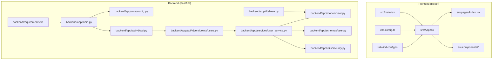
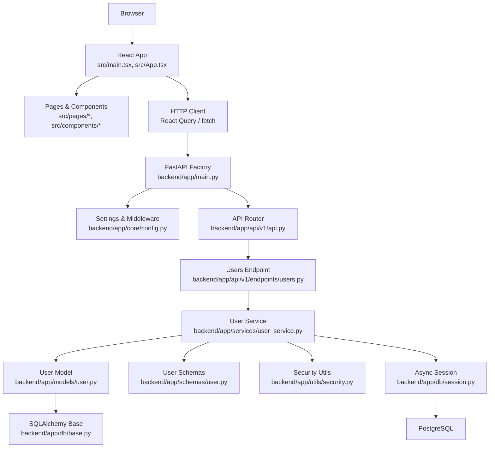
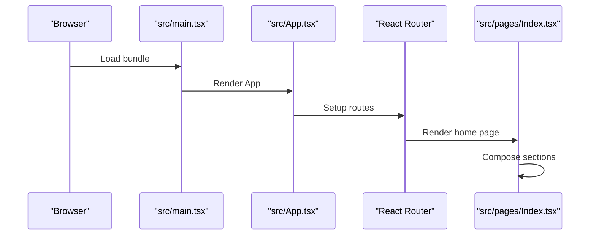
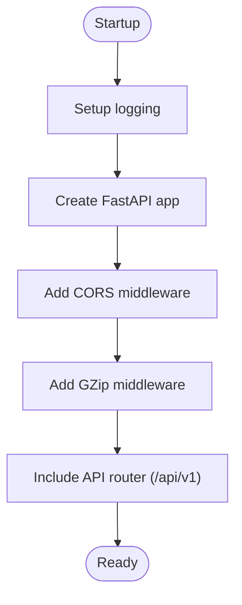
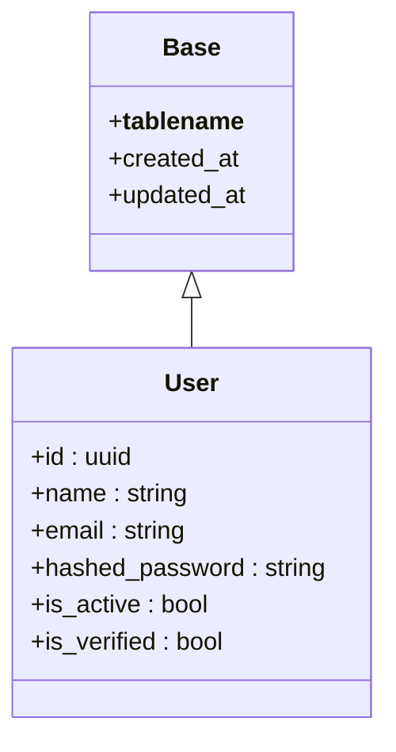
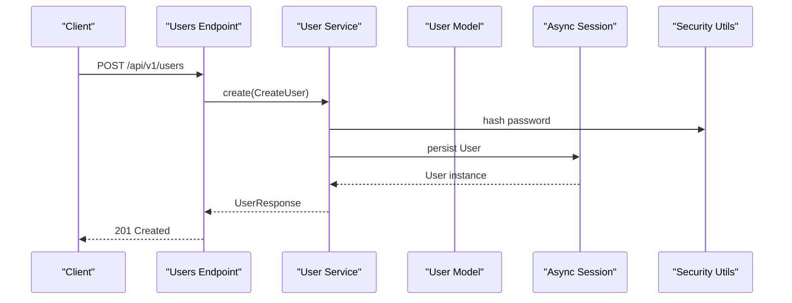
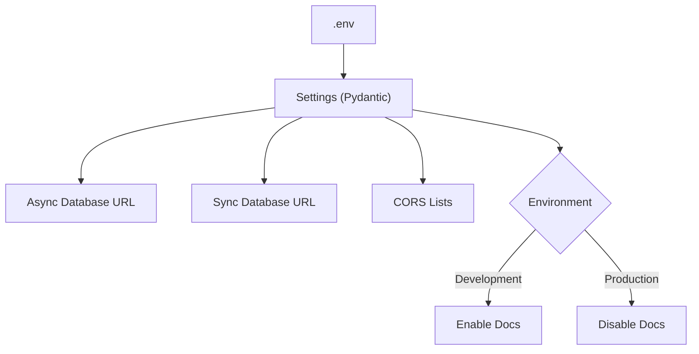
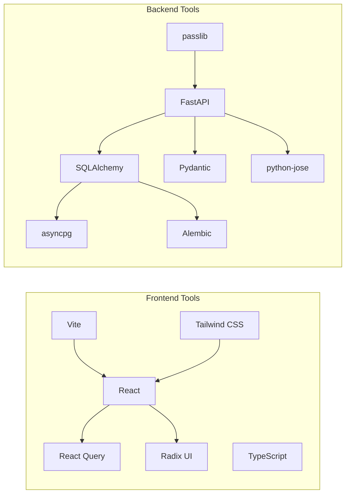

# Project Overview

<cite>
**Referenced Files in This Document**
- [README.md](file://README.md)
- [package.json](file://package.json)
- [vite.config.ts](file://vite.config.ts)
- [tailwind.config.ts](file://tailwind.config.ts)
- [backend/app/main.py](file://backend/app/main.py)
- [backend/app/core/config.py](file://backend/app/core/config.py)
- [backend/app/api/v1/api.py](file://backend/app/api/v1/api.py)
- [backend/app/db/base.py](file://backend/app/db/base.py)
- [backend/requirements.txt](file://backend/requirements.txt)
- [backend/app/models/user.py](file://backend/app/models/user.py)
- [backend/app/schemas/user.py](file://backend/app/schemas/user.py)
- [backend/app/services/user_service.py](file://backend/app/services/user_service.py)
- [backend/app/utils/security.py](file://backend/app/utils/security.py)
- [backend/app/api/v1/endpoints/users.py](file://backend/app/api/v1/endpoints/users.py)
- [src/App.tsx](file://src/App.tsx)
- [src/main.tsx](file://src/main.tsx)
- [src/pages/Index.tsx](file://src/pages/Index.tsx)
</cite>

## Table of Contents
1. [Introduction](#introduction)
2. [Project Structure](#project-structure)
3. [Core Components](#core-components)
4. [Architecture Overview](#architecture-overview)
5. [Detailed Component Analysis](#detailed-component-analysis)
6. [Dependency Analysis](#dependency-analysis)
7. [Performance Considerations](#performance-considerations)
8. [Troubleshooting Guide](#troubleshooting-guide)
9. [Conclusion](#conclusion)

## Introduction
Hyrex AI is a production-ready full-stack foundation for building AI-powered applications. It combines a modern React frontend with TypeScript and Vite, styled with Tailwind CSS and shadcn/ui, and a robust FastAPI backend powered by asynchronous Python and SQLAlchemy. The project emphasizes developer productivity, scalability, and maintainability, offering a clean architecture that supports rapid iteration and future AI feature integration.

Key value propositions:
- Full-stack scaffolding with a cohesive tech stack optimized for modern web applications
- Production-grade backend with async-first design, structured routing, and secure defaults
- Developer-friendly frontend with component modularity, reactive state, and UI primitives
- Strong typing and validation across the stack using TypeScript and Pydantic
- Extensible architecture ready to incorporate AI services, ML APIs, and advanced data flows

## Project Structure
The repository is organized into two primary areas:
- Frontend (React + TypeScript): Located under the repository root, with Vite configuration, Tailwind CSS, and component-driven UI
- Backend (FastAPI + SQLAlchemy): Located under backend/, with modular API routing, database models, services, and configuration

**Diagram sources**
- [src/main.tsx:1-6](file://src/main.tsx#L1-L6)
- [src/App.tsx:1-34](file://src/App.tsx#L1-L34)
- [src/pages/Index.tsx:1-30](file://src/pages/Index.tsx#L1-L30)
- [vite.config.ts:1-22](file://vite.config.ts#L1-L22)
- [tailwind.config.ts:1-118](file://tailwind.config.ts#L1-L118)
- [backend/app/main.py:1-116](file://backend/app/main.py#L1-L116)
- [backend/app/core/config.py:1-131](file://backend/app/core/config.py#L1-L131)
- [backend/app/api/v1/api.py:1-14](file://backend/app/api/v1/api.py#L1-L14)
- [backend/app/db/base.py:1-26](file://backend/app/db/base.py#L1-L26)
- [backend/app/api/v1/endpoints/users.py:1-119](file://backend/app/api/v1/endpoints/users.py#L1-L119)
- [backend/app/models/user.py:1-50](file://backend/app/models/user.py#L1-L50)
- [backend/app/schemas/user.py:1-49](file://backend/app/schemas/user.py#L1-L49)
- [backend/app/services/user_service.py:1-127](file://backend/app/services/user_service.py#L1-L127)
- [backend/app/utils/security.py:1-98](file://backend/app/utils/security.py#L1-L98)
- [backend/requirements.txt:1-39](file://backend/requirements.txt#L1-L39)

**Section sources**
- [README.md:53-61](file://README.md#L53-L61)
- [package.json:15-89](file://package.json#L15-L89)
- [vite.config.ts:1-22](file://vite.config.ts#L1-L22)
- [tailwind.config.ts:1-118](file://tailwind.config.ts#L1-L118)
- [backend/app/main.py:1-116](file://backend/app/main.py#L1-L116)
- [backend/app/core/config.py:1-131](file://backend/app/core/config.py#L1-L131)
- [backend/app/api/v1/api.py:1-14](file://backend/app/api/v1/api.py#L1-L14)
- [backend/app/db/base.py:1-26](file://backend/app/db/base.py#L1-L26)
- [backend/requirements.txt:1-39](file://backend/requirements.txt#L1-L39)

## Core Components
- Frontend entry and routing:
  - Root rendering and app shell with React Query, routing, and global providers
  - Page composition using modular components
- Backend application factory:
  - Centralized app creation with middleware, lifespan, and global exception handling
  - Structured API router aggregation and environment-aware docs exposure
- Database layer:
  - Shared declarative base with automatic table naming and audit timestamps
  - Asynchronous SQLAlchemy setup and session management
- User domain:
  - Model with UUID primary key, unique email, and verification flags
  - Pydantic schemas for request/response validation
  - Service layer implementing password hashing, CRUD, and authentication helpers
- Security utilities:
  - JWT token creation and decoding with configurable expiration and algorithm
- Configuration:
  - Environment-driven settings for server, database, CORS, security, logging, and pagination

**Section sources**
- [src/main.tsx:1-6](file://src/main.tsx#L1-L6)
- [src/App.tsx:1-34](file://src/App.tsx#L1-L34)
- [src/pages/Index.tsx:1-30](file://src/pages/Index.tsx#L1-L30)
- [backend/app/main.py:49-82](file://backend/app/main.py#L49-L82)
- [backend/app/db/base.py:10-26](file://backend/app/db/base.py#L10-L26)
- [backend/app/models/user.py:13-49](file://backend/app/models/user.py#L13-L49)
- [backend/app/schemas/user.py:10-49](file://backend/app/schemas/user.py#L10-L49)
- [backend/app/services/user_service.py:18-127](file://backend/app/services/user_service.py#L18-L127)
- [backend/app/utils/security.py:27-98](file://backend/app/utils/security.py#L27-L98)
- [backend/app/core/config.py:11-131](file://backend/app/core/config.py#L11-L131)

## Architecture Overview
High-level system architecture integrating frontend and backend:

**Diagram sources**
- [src/main.tsx:1-6](file://src/main.tsx#L1-L6)
- [src/App.tsx:1-34](file://src/App.tsx#L1-L34)
- [backend/app/main.py:49-82](file://backend/app/main.py#L49-L82)
- [backend/app/core/config.py:11-131](file://backend/app/core/config.py#L11-L131)
- [backend/app/api/v1/api.py:1-14](file://backend/app/api/v1/api.py#L1-L14)
- [backend/app/api/v1/endpoints/users.py:1-119](file://backend/app/api/v1/endpoints/users.py#L1-L119)
- [backend/app/services/user_service.py:18-127](file://backend/app/services/user_service.py#L18-L127)
- [backend/app/models/user.py:13-49](file://backend/app/models/user.py#L13-L49)
- [backend/app/schemas/user.py:10-49](file://backend/app/schemas/user.py#L10-L49)
- [backend/app/utils/security.py:27-98](file://backend/app/utils/security.py#L27-L98)
- [backend/app/db/base.py:10-26](file://backend/app/db/base.py#L10-L26)

## Detailed Component Analysis

### Frontend: React Application Shell
- Entry point initializes the root and renders the App component
- App wraps children with React Query provider, routing, authentication context, and UI providers
- Index page composes marketing and product sections using reusable components

**Diagram sources**
- [src/main.tsx:1-6](file://src/main.tsx#L1-L6)
- [src/App.tsx:14-31](file://src/App.tsx#L14-L31)
- [src/pages/Index.tsx:12-26](file://src/pages/Index.tsx#L12-L26)

**Section sources**
- [src/main.tsx:1-6](file://src/main.tsx#L1-L6)
- [src/App.tsx:1-34](file://src/App.tsx#L1-L34)
- [src/pages/Index.tsx:1-30](file://src/pages/Index.tsx#L1-L30)

### Backend: FastAPI Application Factory
- Application lifecycle managed via lifespan for startup/shutdown
- Global middleware includes CORS and gzip compression
- API router mounted under /api/v1 with environment-aware docs exposure
- Health check and root endpoints included

**Diagram sources**
- [backend/app/main.py:22-82](file://backend/app/main.py#L22-L82)

**Section sources**
- [backend/app/main.py:1-116](file://backend/app/main.py#L1-L116)

### Database Layer: SQLAlchemy Base and User Model
- Base class defines automatic table naming and shared audit columns
- User model includes UUID primary key, unique email, hashed password, and verification flags
- Schemas define validation for create, update, and response payloads

**Diagram sources**
- [backend/app/db/base.py:10-26](file://backend/app/db/base.py#L10-L26)
- [backend/app/models/user.py:13-49](file://backend/app/models/user.py#L13-L49)

**Section sources**
- [backend/app/db/base.py:1-26](file://backend/app/db/base.py#L1-L26)
- [backend/app/models/user.py:1-50](file://backend/app/models/user.py#L1-L50)
- [backend/app/schemas/user.py:1-49](file://backend/app/schemas/user.py#L1-L49)

### User Management API: Endpoints and Service
- Endpoints support listing, creating, retrieving, updating, and deleting users with pagination and validation
- Service layer handles password hashing, authentication checks, and CRUD operations
- Security utilities provide JWT token creation and decoding

**Diagram sources**
- [backend/app/api/v1/endpoints/users.py:33-53](file://backend/app/api/v1/endpoints/users.py#L33-L53)
- [backend/app/services/user_service.py:51-74](file://backend/app/services/user_service.py#L51-L74)
- [backend/app/utils/security.py:22-24](file://backend/app/utils/security.py#L22-L24)

**Section sources**
- [backend/app/api/v1/endpoints/users.py:1-119](file://backend/app/api/v1/endpoints/users.py#L1-L119)
- [backend/app/services/user_service.py:1-127](file://backend/app/services/user_service.py#L1-L127)
- [backend/app/utils/security.py:1-98](file://backend/app/utils/security.py#L1-L98)

### Configuration and Environment Management
- Settings loaded from environment variables with Pydantic Settings
- Supports development, testing, and production modes with appropriate defaults
- Generates async and sync database URLs and parses CORS lists

**Diagram sources**
- [backend/app/core/config.py:11-131](file://backend/app/core/config.py#L11-L131)

**Section sources**
- [backend/app/core/config.py:1-131](file://backend/app/core/config.py#L1-L131)

## Dependency Analysis
Technology stack and integration points:
- Frontend: Vite, React, TypeScript, shadcn/ui, Tailwind CSS, React Router, React Query
- Backend: FastAPI, Uvicorn, SQLAlchemy asyncio, asyncpg, Alembic, Pydantic, python-jose, passlib
- Development and testing: pytest, httpx, Vitest, Playwright, ESLint, PostCSS, Tailwind

**Diagram sources**
- [package.json:15-89](file://package.json#L15-L89)
- [backend/requirements.txt:1-39](file://backend/requirements.txt#L1-L39)

**Section sources**
- [README.md:53-61](file://README.md#L53-L61)
- [package.json:15-89](file://package.json#L15-L89)
- [backend/requirements.txt:1-39](file://backend/requirements.txt#L1-L39)

## Performance Considerations
- Backend compression: GZip middleware enabled for responses above a threshold
- Async database operations: SQLAlchemy asyncio and asyncpg for scalable I/O
- Environment-aware docs: Disabled in production to reduce overhead
- Frontend build optimization: Vite provides fast builds and HMR during development

[No sources needed since this section provides general guidance]

## Troubleshooting Guide
- Health checks: Use the /health endpoint to verify backend availability
- Root metadata: The root endpoint returns application metadata and docs location
- Global exception handling: Centralized handler logs errors and returns standardized responses
- CORS configuration: Verify allowed origins, methods, and headers align with frontend origin
- Database connectivity: Confirm async database URL and credentials; ensure PostgreSQL is reachable

**Section sources**
- [backend/app/main.py:109-116](file://backend/app/main.py#L109-L116)
- [backend/app/main.py:98-106](file://backend/app/main.py#L98-L106)
- [backend/app/main.py:85-95](file://backend/app/main.py#L85-L95)
- [backend/app/core/config.py:40-53](file://backend/app/core/config.py#L40-L53)
- [backend/app/core/config.py:75-91](file://backend/app/core/config.py#L75-L91)

## Conclusion
Hyrex AI provides a solid, production-ready foundation for building modern AI-powered applications. Its full-stack architecture balances developer ergonomics with operational excellence, enabling teams to iterate quickly while maintaining scalability and security. The modular backend and component-driven frontend offer clear extension points for integrating AI services, ML pipelines, and advanced data visualization, positioning the project as a versatile platform for next-generation applications.